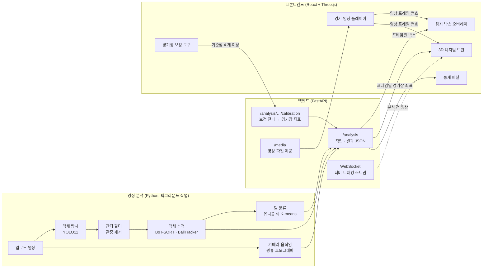

# Soccer 3D Digital Twin — 기술 및 기능 명세

> 축구 경기 영상을 분석해 선수와 공의 위치를 추적하고, 이를 3D 디지털 트윈으로 재현해 영상과 같은 타임라인에서 보여주는 분석 플랫폼입니다.
>
> 이 문서는 **현재 코드 기준**으로 사용 기술, 구현된 기능, 알려진 제약, 향후 구현 계획을 정리합니다. 빠른 실행 방법은 [README](../README.md)를 참고하세요.
>
> **다음 문서**: [2부 — 영상 분석 · 경기장 보정 · 3D 트윈 연동](./PROJECT_OVERVIEW_2_VIDEO_ANALYSIS.md) · [3부 — CV 고도화 · VLM 설계](./PROJECT_OVERVIEW_3_VLM.md) · [4부 — 고정밀 분석 모드](./PROJECT_OVERVIEW_4_PRECISE_ANALYSIS.md)

---

## 목차

1. [시스템 구성](#1-시스템-구성)
2. [사용 기술](#2-사용-기술)
3. [구현된 기능](#3-구현된-기능)
4. [구현 상태 요약](#4-구현-상태-요약)
5. [알려진 제약 및 이슈](#5-알려진-제약-및-이슈)
6. [향후 구현 계획](#6-향후-구현-계획)

---

## 1. 시스템 구성



| 계층 | 위치 | 역할 |
|---|---|---|
| 탐지·추적 모듈 | `tracking/` | YOLO 탐지, 다중 객체 추적, 공 추적, 호모그래피 |
| 파이프라인 | `pipeline/main_pipeline.py` | 설정 기반 컴포넌트 구성, 프레임 처리 |
| 영상 분석 | `pipeline/video_analysis.py` | 업로드 영상 분석(박스·카메라 움직임·팀), 경기장 보정 전파 |
| 3DGS 모델 | `gs_model/` | 3D Gaussian Splatting 표준 공간 및 변형 네트워크 (렌더링 미연동) |
| 백엔드 | `backend/server.py` | 업로드·영상 제공, 분석 작업·결과·보정 API, WebSocket 스트림 |
| 프론트엔드 | `frontend/src/` | 영상 플레이어·탐지 박스 오버레이·보정 도구·3D 트윈·통계 UI |
| 테스트 | `tests/` | 단위·통합 테스트 35 개 |
| 설정 | `configs/` | 모델·분석·추적·경기장 규격 설정 |

---

## 2. 사용 기술

### 2.1 컴퓨터 비전 / 분석

| 기술 | 버전 | 사용 위치 | 역할 및 선택 이유 |
|---|---|---|---|
| **Ultralytics YOLO11** | 8.4 | `tracking/detector.py` | 객체 탐지. CPU 기본값은 `yolo11n`(선수 640 px, 공 960 px), GPU 에서는 `yolo11s` 권장 |
| **Roboflow 축구 전문 모델** | — | `setup_roboflow.py`, `scripts/` | 선수·공·경기장 전용 모델. 경로를 지정하면 COCO 범용 모델 대신 사용 |
| **boxmot BoT-SORT** | 25.0 | `tracking/tracker.py` | 다중 객체 추적. **희소 광류 카메라 움직임 보정(CMC)** 으로 팬·줌하는 중계 화면에서 ID 가 가장 안정적 (아래 비교표) |
| **OpenCV** | 4.x / 5.0 | 분석 전반 | 광류(`calcOpticalFlowPyrLK`)·호모그래피(`findHomography` RANSAC)·K-means·HSV 잔디 마스크·영상 입출력 |
| **NumPy** | 2.x | 전반 | IoU 행렬, 호모그래피 합성, 좌표 변환 |
| **PyTorch** | 2.x (CPU) | YOLO 추론, `gs_model/` | 추론 스레드 수를 제한해 같은 PC 의 UI 응답성 확보 |

### 2.2 백엔드

| 기술 | 버전 | 역할 |
|---|---|---|
| **Python** | 3.12 | 런타임 |
| **FastAPI** | 0.1xx | REST API, WebSocket, 요청 검증(Pydantic) |
| **ThreadPoolExecutor** | 표준 라이브러리 | 영상 분석 백그라운드 작업 (작업자 1 개 — CPU 추론은 순차 처리) |
| **Starlette StaticFiles / FileResponse** | — | 영상 제공(HTTP Range 206), 분석 결과 JSON 제공 |
| **Uvicorn[standard]** | — | ASGI 서버. `[standard]` 에 WebSocket 라이브러리 포함 |
| **python-multipart** | — | 파일 업로드(`UploadFile`) 파싱 |

### 2.3 프론트엔드

| 기술 | 버전 | 역할 |
|---|---|---|
| **React** | 19.3 | UI 컴포넌트, 상태 관리 |
| **Vite** | 8.3 | 개발 서버, 번들링 |
| **Three.js / React Three Fiber / drei** | 0.186 / 9.8 / 10.7 | 3D 트윈 렌더링 |
| **Canvas 2D** | 브라우저 내장 | 영상 위 탐지 박스·보정점 오버레이 |
| **`requestVideoFrameCallback`** | 브라우저 내장 | 화면에 표시된 **영상 프레임 번호**를 정확히 받아 박스·3D 를 프레임 단위로 동기화 |
| **SVG** | 브라우저 내장 | 보정용 탑다운 경기장 도면 |
| **Pretendard** | 1.3.9 (npm 번들, 외부 CDN 없음) | 한글 UI 서체 |
| **oxlint** | 1.83 | 린트 |

### 2.4 테스트 / 개발 도구

| 기술 | 역할 |
|---|---|
| **pytest** | 단위·통합 테스트 (`tests/test_core.py`, `tests/test_analysis.py`) |
| **FastAPI TestClient (httpx)** | REST·WebSocket API 테스트 |
| **합성 영상 + 가짜 탐지기** | YOLO 없이 분석·보정 로직을 수 초 안에 검증 |

---

## 3. 구현된 기능

### 3.1 객체 탐지 — `tracking/detector.py`

- **`Detection` 데이터클래스**로 탐지 결과 형식을 통일했습니다 (`bbox`, `confidence`, `class_id`, `class_name`, `type` / 계산 속성 `center`, `area`, `is_ball`, `label`).
- **모델별 class_id 오프셋**: `0~99` 선수 모델, `100~199` 공 모델(`is_ball`), `200~` 경기장 모델
- **COCO 범용 모델 클래스 필터**: 모델이 COCO(`sports ball` 클래스 보유)이면 선수 모델은 `person`, 공 모델은 `sports ball` 만 추론합니다. 필터가 없으면 공 모델이 사람·의자 등 80 개 클래스를 모두 공 후보로 냅니다. Roboflow 전용 모델은 필터 없이 사용합니다.
- **모델별 추론 해상도**: 중계 화면의 공은 10~15 px 이라 공 모델만 높은 해상도(`analysis.ball_imgsz`, 기본 960)로 추론합니다.
- `ultralytics`(torch)는 실제 모델을 만들 때만 import 합니다.

### 3.2 객체 추적 — `tracking/tracker.py`

#### `make_tracker(type)`
`'botsort' | 'bytetrack' | 'simple'` 을 받아 같은 형태(`update(det_array, frame) → [[x1, y1, x2, y2, id, conf, cls, ...]]`)의 추적기를 만듭니다. boxmot 버전별 클래스 이름(`BotSort`/`BoTSORT`, `ByteTrack`/`BYTETracker`)을 모두 지원하고, 사용할 수 없으면 `SimpleTracker` 로 대체합니다.

#### 추적기 비교 (실제 중계 영상, 3 프레임 간격 25 회 갱신)

| 추적기 | 탐지 대비 출력 비율 | 고유 ID 수 (적을수록 안정) |
|---|---|---|
| SimpleTracker (IoU) | 1.00 | 114 — ID 가 계속 바뀜 |
| ByteTrack | 0.67 | 39 |
| **BoT-SORT + 희소 광류 CMC** | **0.88** | **22** |

중계 카메라가 움직이면 칼만 필터 예측과 실제 박스가 어긋나 ByteTrack 은 트랙을 잃습니다. BoT-SORT 는 프레임 간 카메라 움직임을 보정한 뒤 매칭하므로 기본값으로 사용합니다(`configs/model_config.yaml` 의 `tracking.type`).

#### ID 규칙
- 공은 항상 `BALL_TRACK_ID = 0` (BallTracker)
- 다중 객체 추적기 ID 는 **+1** 해서 1 부터 사용합니다. boxmot 25 는 ID 를 0 부터 매기므로, 이 보정이 없으면 공 ID 와 충돌합니다.

#### BallTracker — 공 단일 ID 추적
1. 직전 위치와 속도로 이번 위치를 **예측**(등속 가정)
2. 예측 위치에서 `max_jump` 이내 후보 중 **가장 가까운 것** 선택 — 궤적에서 벗어난 오탐 무시
3. **가려진** 동안 예측을 이어가 재포착
4. `max_missing` 이상 놓치면 가장 신뢰도 높은 후보로 **재획득**

영상 분석에서는 탐지 간격(stride)만큼 `max_jump` 를 키워 사용합니다.

### 3.3 좌표 변환 — `tracking/homography.py`

- 기준점 대응으로 호모그래피를 계산해 픽셀 ↔ 경기장 좌표(미터)를 변환합니다. 경기장은 FIFA 표준 105 × 68 m, 원점은 센터 스폿입니다.
- `pixels_to_world()` 로 한 프레임의 모든 객체를 한 번에 변환합니다.

### 3.4 통합 파이프라인 — `pipeline/main_pipeline.py`

- 설정 파일 기반으로 탐지기·추적기를 구성합니다. `initialize_detector()` 는 탐지기만, `initialize_components()` 는 3DGS 까지 초기화합니다.
- `make_tracker()` 는 `tracking` 섹션(type·threshold·max_age)으로 새 추적기를 만듭니다. 영상마다 ID 를 새로 시작할 때 사용합니다.
- **의존성 주입**: `Soccer3DPipeline(detector=, tracker=, homography=, coord_mapper=)`
- 설정 키를 실제 YAML(`tracking`, `gaussian_splatting.canonical_space`)과 맞췄습니다. 이전 키(`tracker`, `gaussian`)도 호환합니다.

### 3.5 영상 분석 — `pipeline/video_analysis.py`

업로드한 영상을 프레임 단위로 분석해 JSON 으로 저장합니다(`uploads/analysis/{영상}.json`).

| 단계 | 방법 |
|---|---|
| **탐지** | `stride` 프레임마다 YOLO 탐지 (CPU 기본 3). 사이 프레임은 트랙별 박스를 **선형 보간** |
| **관중 제거** | HSV 잔디 마스크에서 선수 발 주변(박스 하단을 넓힌 영역)에 잔디가 15 % 이상인 사람만 유지. 다른 선수와 겹쳐 발이 가려져도 주변 잔디로 판정 |
| **공 오탐 제거** | 박스 가로세로비 0.6~1.7 만 공 후보 — 잔디 위 흰 줄·자국 같은 길쭉한 오탐 제거 |
| **추적** | SoccerTracker (BoT-SORT + BallTracker) |
| **카메라 움직임** | 모든 프레임에서, 선수 박스를 가린 배경 특징점(`goodFeaturesToTrack`)을 광류로 추적 → RANSAC 호모그래피 `M_t` (이전 → 현재 프레임). 중계 카메라는 고정 위치에서 회전·줌하므로 배경 전체가 하나의 호모그래피로 움직입니다. 장면 전환 등으로 인라이어가 부족하면 `null` |
| **팀 분류** | 트랙별 상체 영역 평균 색(Lab, 잔디 픽셀 제외)을 샘플링 → 트랙 대표색을 **K-means(k=2)** → 트랙이 많은 군집을 `home`, 두 군집 모두에서 먼 트랙은 `other`(심판·골키퍼 등). 군집 중심색을 실제 유니폼 색으로 저장 |

결과 형식:

```json
{
  "fps": 30, "width": 1920, "height": 1080, "frame_count": 1054, "stride": 3,
  "frames": [[[track_id, kind(0 선수 / 1 공), x1, y1, x2, y2, conf], ...], ...],
  "motion": [null, [9 개 값], ...],
  "teams": {"12": "home", "7": "away", "3": "other"},
  "team_colors": {"home": "#665145", "away": "#c5d2dd"},
  "calibration": {"keyframes": [...]},
  "world": [[[track_id, x, y], ...], null, ...]
}
```

### 3.6 경기장 보정 — 움직이는 카메라 대응

중계 화면은 카메라가 계속 팬·줌하므로 고정 호모그래피 하나로는 경기장 좌표를 구할 수 없습니다. 한 프레임만 보정하면 카메라 움직임을 따라 전 프레임으로 전파합니다.

1. 사용자가 한 프레임(키프레임 k)에서 경기장 기준점 4 개 이상을 지정 → 이미지 → 경기장 호모그래피 `H_k`
2. 분석 때 구한 프레임 간 움직임 `M_t` 로 전파

   ```
   H_t = H_k · M_k ··· M_{t+1}          (t < k)
   H_t = H_k · M_{k+1}⁻¹ ··· M_t⁻¹      (t > k)
   ```

3. 각 프레임 선수의 **발 위치**(박스 하단 중앙)를 `H_t` 로 변환 → 경기장 좌표. 경기장 밖 5 m 이상 벗어난 객체는 제외
4. 키프레임은 여러 개 둘 수 있고, 프레임마다 **가장 가까운 키프레임**을 사용합니다. 움직임 추정이 끊긴 구간(장면 전환) 너머로는 전파하지 않으므로, 그 구간에서 보정을 추가하면 됩니다.

실제 영상 검증(프레임 0, 기준점 5 개): 재투영 오차 0.15 m 이하, 화면 하단이 근처 터치라인(y ≈ −30 m)에 대응.

보정용 기준점(`frontend/src/analysis.js` 의 `LANDMARKS`, 31 개): 센터 스폿, 하프라인과 터치라인·센터서클 교점, 코너, 페널티박스·골에어리어 모서리, 페널티 스폿, 페널티 아크와 박스선 교점

### 3.7 백엔드 API — `backend/server.py`

#### REST

| 메서드 | 경로 | 설명 |
|---|---|---|
| `GET` | `/health` | 서버 상태 |
| `POST` | `/upload_video` | 영상 업로드. 파일명 정규화(경로 조작 차단), 청크 저장, 읽을 수 없는 파일은 400 과 함께 삭제 |
| `GET` | `/videos` | 업로드된 영상 목록 (최신순) |
| `GET` | `/media/{filename}` | 영상 파일 제공. Range 요청(206) 지원 |
| `POST` | `/analysis/{name}` | 영상 분석 시작 (백그라운드, 진행 중이면 409) |
| `GET` | `/analysis/{name}/status` | `none` / `queued` / `running`(progress 0~1) / `done`(calibrated) / `error` |
| `GET` | `/analysis/{name}` | 분석 결과 JSON |
| `POST` | `/analysis/{name}/calibration` | `{keyframes: [{frame, points: [{image: [u, v], pitch: [x, y]}]}]}` → 전 프레임 경기장 좌표 계산·저장. 점 부족·일직선이면 400 |
| `GET` | `/get_tracking_data/{frame}` | 더미 프레임 데이터 |

- 분석 작업은 작업자 1 개 스레드풀에서 순차 처리합니다. 탐지 모델은 첫 분석 때 한 번만 로드합니다.
- 추론 스레드를 `CPU 코어 − 2` 로 제한해, 분석 중에도 같은 PC 의 브라우저와 API 가 응답하도록 합니다.

#### WebSocket `/ws/stream` (분석 전 영상용 더미 스트림)

| 메시지 | 동작 |
|---|---|
| `{"type": "start", "frame": N}` | N 프레임부터 재생 |
| `{"type": "pause"}` | 일시정지 |
| `{"type": "seek", "frame": N, "paused": bool}` | 이동 + 재생/정지 설정. 정지 상태면 해당 프레임을 한 번 전송 |

수신과 송신을 별도 태스크로 분리하고, 목표 시각에 맞춰 대기해 30 FPS 를 유지합니다.

### 3.8 프론트엔드 — `frontend/src/`

| 파일 | 역할 |
|---|---|
| `App.jsx` | 화면 구성, 영상 ↔ 분석 ↔ 3D 데이터 흐름, 분석 카드 |
| `components/VideoOverlay.jsx` | 영상 위 canvas 에 탐지 박스(팀 색·`#ID`, 공 `BALL`)와 보정점 표시, 보정 클릭 좌표 변환 |
| `components/CalibrationPanel.jsx` | 탑다운 경기장 도면에서 기준점 선택 → 영상 클릭 → 저장 |
| `analysis.js` | 기준점 목록, 분석 프레임 → 3D 데이터 변환(속도 계산), 레터박스 좌표 계산 |
| `components/api.js` | REST / WebSocket 클라이언트 |

#### 사용 흐름
1. 라이브러리에서 영상 선택 → **분석 시작** → 진행률 표시(1.5 초 간격 폴링), 완료 시 자동 로드
2. 영상 위에 **탐지 박스**가 프레임 단위로 표시됨 (토글 가능)
3. **경기장 보정**: 도면에서 기준점 클릭 → 영상에서 같은 지점 클릭 (4 개 이상) → 저장
4. 3D 트윈이 **분석 데이터**로 전환되어 영상과 같은 프레임의 선수·공 위치를 실제 유니폼 색으로 표시

#### 동기화
- `requestVideoFrameCallback` 으로 **화면에 표시 중인 영상 프레임 번호**를 받아 박스와 3D 를 갱신합니다(네트워크 지연 없음, 미지원 브라우저는 `timeupdate` 로 대체).
- 3D 데이터 소스: 분석 + 보정된 영상 → 분석 데이터 / 분석됐지만 보정 전 → 보정 안내 / 분석 전 → 더미 스트림. 3D 창 라벨에 현재 소스를 표시합니다.
- 속도는 0.2 초(6 프레임) 간 경기장 좌표 이동거리로 계산하고, 보정 오차로 튀는 값은 12 m/s 로 제한해 표시합니다.

#### 3D 화면 · 디자인
- 줄무늬 잔디, FIFA 규격 라인, 팀 색 캡슐 마커, 발광하는 공. 카메라: 자유 시점 / 탑다운 / 선수 시점 (창 비율에 맞춰 거리 보정)
- 다크 테마(`#0A0B0D`), 강조색 `#D7FF3C`, Pretendard + `tabular-nums`, 인라인 SVG 아이콘, 반응형 레이아웃

### 3.9 테스트 — `tests/`

```bash
python -m pytest tests -q
```

YOLO·GPU 없이 실행되는 35 개 테스트입니다.

| 파일 | 검증 내용 |
|---|---|
| `test_core.py` | 호모그래피, 탐지(오프셋·라벨·COCO 클래스 필터), 추적(ID·속도·주입·공 ID 충돌 없음), 공 추적, 파이프라인 통합, 업로드·목록·Range, WebSocket(연속 전송·잘못된 메시지·정지 중 탐색) |
| `test_analysis.py` | 카메라 움직임 복원(합성 팬)·장면 전환 감지, 보정 전파(앞·뒤·끊김·최근접 키프레임), 발 위치 변환·경기장 밖 제외·잘못된 보정점 거부, 박스 보간, 공 형태·잔디 판정, 팀 군집, 합성 영상 분석(stride·보간·공 ID), 분석 API 전체 흐름·경로 조작 차단 |

---

## 4. 구현 상태 요약

| 기능 | 상태 | 비고 |
|---|---|---|
| YOLO11 탐지 · COCO 클래스 필터 | 완료 | 실제 중계 영상으로 검증 |
| 다중 객체 추적 (BoT-SORT CMC) | 완료 | 실제 영상으로 ByteTrack·Simple 과 비교 |
| 공 단일 ID 추적 | 완료 | 탐지 자체가 약함 (아래 제약) |
| 업로드 영상 분석 작업 | 완료 | CPU 에서 느림 (아래 제약) |
| 영상 위 탐지 박스 오버레이 | 완료 | 프레임 단위 동기화 |
| 팀 자동 분류 (유니폼 색) | 완료 | 골키퍼는 대개 `other` |
| 카메라 움직임 추정 · 보정 전파 | 완료 | |
| **분석 결과 → 3D 트윈 연동** | **완료** | **수동 경기장 보정 필요** |
| **고정밀 분석 모드** | **완료** | 라인 정렬 보정·트랙 잇기·좌표 평활화·경기 지표 — [4부](./PROJECT_OVERVIEW_4_PRECISE_ANALYSIS.md) |
| 자동 경기장 보정 | 부분 | 키프레임 이후 매 프레임 라인 자동 정렬 완료, 첫 키프레임은 수동 ([4부 36절](./PROJECT_OVERVIEW_4_PRECISE_ANALYSIS.md#36-한계와-다음-단계)) |
| 3D Gaussian Splatting 렌더링 | 부분 | 모듈만 존재, `render()` 미구현 |

---

## 5. 알려진 제약 및 이슈

| 구분 | 내용 | 대응 |
|---|---|---|
| 속도 | CPU(5 코어)에서 stride 3 기준 약 **1 초/프레임** — 35 초 영상에 수십 분. 분석 중에는 브라우저도 느려질 수 있음 | GPU 사용 시 `analysis.stride: 1`, `yolo11s` 권장 |
| 공 탐지 | COCO 범용 모델은 10~15 px 중계 화면 공을 자주 놓침 (실제 영상에서 공 검출 프레임 비율이 낮음) | 축구 공 전용 모델 학습·적용 ([6.1](#61-1단계--정확도와-자동화)) |
| 보정 | 경기장 보정은 사용자가 기준점을 직접 지정 | 경기장 키포인트 자동 검출 |
| 보정 누적 오차 | 카메라 움직임을 프레임마다 합성하므로 키프레임에서 멀어질수록 오차가 누적될 수 있음 | 긴 영상은 여러 프레임에 보정 추가, 자동 보정으로 주기적 재보정 |
| 장면 전환 | 리플레이·컷 이후 구간은 보정이 전파되지 않음 (3D 에 안내 표시) | 해당 구간에 보정 추가 |
| 팀 분류 | 골키퍼·심판은 `other`, 트랙이 짧으면 샘플 부족으로 `other` | SigLIP 임베딩 + 위치 기반 골키퍼 보정 |
| 가려짐 | 선수가 겹치면 탐지가 합쳐지거나 누락, 보간 구간에 없는 트랙은 표시 안 됨 | 탐지 간격 축소(GPU), ReID |
| 작업 상태 | 진행 중 작업 상태는 메모리에만 있어 서버 재시작 시 사라짐 (완료 결과는 파일로 유지) | 작업 큐/DB |
| 코덱 | 브라우저는 MPEG-4 Part 2 등을 재생하지 못함 | 업로드 시 H.264 자동 변환 |
| 보안 | CORS 모든 출처 허용, `.env`(API 키)가 저장소에 커밋되어 있음 | 배포 전 출처 제한, 키 재발급 및 추적 해제 |
| 연결 | 백엔드 재시작 시 WebSocket 자동 재연결 없음 | 지수 백오프 재연결 |
| 파이프라인 CLI | `python -m pipeline.main_pipeline --video` 는 앞 50 프레임만 처리 | 업로드 → 분석 API 사용, 또는 `--max-frames` 인자 추가 |
| 의존성 | `deck.gl`, `react-markdown` 미사용 | 제거 |

---

## 6. 향후 구현 계획

### 6.1 1단계 — 정확도와 자동화

| 기능 | 목적 | 구현 방안 |
|---|---|---|
| **자동 경기장 보정** | 수동 기준점 지정 제거, 누적 오차·장면 전환 해결 | 경기장 키포인트(라인 교차점) 검출 모델 학습(Roboflow football-field 데이터셋) → 프레임별 호모그래피 + 카메라 움직임으로 평활화. 현재 `frame_homographies()` 의 키프레임 입력을 자동 검출로 대체 |
| **공 전용 탐지 모델** | 공 검출률 향상 | Roboflow football-ball 데이터셋으로 YOLO 학습, 고해상도 타일 추론(SAHI), 공 궤적 보간 |
| **GPU 추론** | 분석 시간 단축 | `device: cuda`, stride 1, TensorRT/OpenVINO 내보내기 |
| **분석 진행 실시간 표시** | 긴 분석 중에도 앞부분 확인 | 부분 결과를 주기적으로 저장해 분석 중에도 박스 표시 |
| **코덱 자동 변환** | 모든 영상 재생 | 업로드 후 ffmpeg 로 H.264 MP4 변환 (`-movflags +faststart`) |

### 6.2 2단계 — 분석 기능

| 기능 | 설명 |
|---|---|
| **히트맵** | 선수·팀별 위치 밀도를 3D 바닥 또는 탑다운에 표시 |
| **이동 거리·스프린트** | 경기장 좌표 기반 누적 이동 거리, 스프린트 횟수 (칼만 평활화 적용) |
| **점유율 누적** | 순간 볼 소유 판정을 시간 누적 점유율로 확장 |
| **패스 네트워크** | 공 소유자 변화로 패스 추정 → 선수 간 연결 그래프 |
| **오프사이드 라인** | 수비 최후방 선수 기준 가상 라인을 영상·3D 에 표시 |
| **선수 선택** | 영상 박스나 3D 마커를 클릭해 개인 궤적·통계, 선수 시점 대상 지정 |
| **팀·선수 이름 편집** | 자동 분류 결과 수정, 트랙 ID ↔ 등번호·이름 매핑 |

### 6.3 3단계 — 고품질 3D 재현

| 기능 | 설명 |
|---|---|
| **공 높이(z) 추정** | 공 궤적의 포물선 모델로 공중볼 높이 복원 |
| **SMPL 포즈 복원** | 선수 자세를 인체 모델로 추정해 캡슐 대신 실제 동작 재현 (`HumanGaussianTemplate`, `PoseConditionedDeformer`) |
| **3D Gaussian Splatting 렌더링** | `DynamicGaussianRenderer.render()` 에 `diff-gaussian-rasterization` 연동 |

### 6.4 인프라 / 운영

| 항목 | 내용 |
|---|---|
| 작업 처리 | 작업 큐(Celery/RQ) + 상태 영속화, 작업 취소 |
| 데이터 저장 | 분석 결과·메타데이터 DB 저장 (SQLite → PostgreSQL), 큰 결과는 Parquet |
| 배포 | Docker (백엔드 GPU / 프론트엔드 정적 빌드), 리버스 프록시 |
| 보안 | CORS 출처 제한, 업로드 크기·형식 제한, 인증 |
| 품질 | 프론트엔드 테스트(Vitest), CI 에서 pytest·lint·build 자동 실행 |

---

> 영상 분석·경기장 보정 업데이트의 기술 상세, 실측 결과, 수정한 버그는 **[2부 문서](./PROJECT_OVERVIEW_2_VIDEO_ANALYSIS.md)** 에 이어서 정리되어 있습니다.
