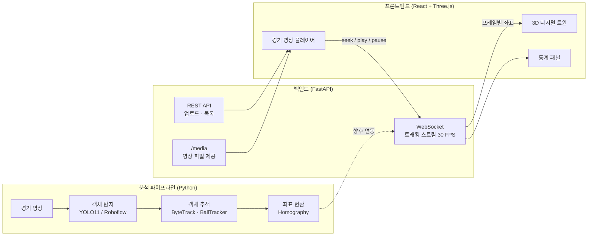

# Soccer 3D Digital Twin — 기술 및 기능 명세

> 축구 경기 영상을 분석해 선수와 공의 위치를 추적하고, 이를 3D 디지털 트윈으로 재현해 영상과 같은 타임라인에서 보여주는 분석 플랫폼입니다.
>
> 이 문서는 **현재 코드 기준**으로 사용 기술, 구현된 기능, 알려진 제약, 향후 구현 계획을 정리합니다. 빠른 실행 방법은 [README](../README.md)를 참고하세요.

---

## 목차

1. [시스템 구성](#1-시스템-구성)
2. [사용 기술](#2-사용-기술)
3. [구현된 기능](#3-구현된-기능)
4. [구현 상태 요약](#4-구현-상태-요약)
5. [알려진 제약 및 이슈](#5-알려진-제약-및-이슈)
6. [향후 구현 계획](#6-향후-구현-계획)

---

## 1. 시스템 구성



| 계층 | 위치 | 역할 |
|---|---|---|
| 분석 파이프라인 | `tracking/`, `pipeline/` | 영상 → 탐지 → 추적 → 경기장 좌표 변환 |
| 3DGS 모델 | `gs_model/` | 3D Gaussian Splatting 표준 공간 및 변형 네트워크 (렌더링 미연동) |
| 백엔드 | `backend/server.py` | 영상 업로드·제공, 트래킹 데이터 WebSocket 스트리밍 |
| 프론트엔드 | `frontend/src/` | 영상 플레이어, 3D 트윈, 통계 UI |
| 테스트 | `tests/test_core.py` | 모듈·API 단위/통합 테스트 22개 |
| 설정 | `configs/` | 모델·추적·경기장 규격 설정 |

---

## 2. 사용 기술

### 2.1 컴퓨터 비전 / 분석

| 기술 | 버전 | 사용 위치 | 역할 및 선택 이유 |
|---|---|---|---|
| **Ultralytics YOLO11** | ≥ 8.0 | `tracking/detector.py` | 실시간 객체 탐지. `yolo11s`(선수), `yolo11n`(공)을 기본으로 사용하며, 정확도·속도 균형이 좋은 최신 YOLO 계열 |
| **Roboflow 축구 전문 모델** | — | `setup_roboflow.py`, `scripts/` | 선수·공·경기장 전용으로 학습된 모델. COCO 범용 모델보다 작은 공과 심판/골키퍼 구분에 유리 |
| **boxmot (ByteTrack / BoT-SORT)** | ≥ 9.0 | `tracking/tracker.py` | 다중 객체 추적(MOT). 저신뢰 탐지까지 활용해 가려짐에 강한 ByteTrack 기본 |
| **OpenCV** | 5.0 | 탐지 시각화, 호모그래피, 영상 메타데이터 | `findHomography`, `perspectiveTransform`, `VideoCapture` |
| **NumPy** | 2.x | 전반 | IoU 행렬 벡터화 계산, 좌표 변환 |
| **PyTorch** | ≥ 2.0 | `gs_model/` | 3DGS 파라미터와 변형 MLP (선택 의존성, 추적 기능만 쓸 때는 불필요) |

### 2.2 백엔드

| 기술 | 버전 | 역할 |
|---|---|---|
| **Python** | 3.12 | 런타임 |
| **FastAPI** | 0.141 | REST API, WebSocket, 요청 검증(Pydantic) |
| **Starlette StaticFiles** | 1.7 | 업로드 영상 제공. HTTP Range(206) 지원으로 브라우저 영상 탐색 가능 |
| **Uvicorn[standard]** | 0.54 | ASGI 서버. `[standard]` 에 WebSocket 라이브러리 포함 |
| **python-multipart** | — | 파일 업로드(`UploadFile`) 파싱 |

### 2.3 프론트엔드

| 기술 | 버전 | 역할 |
|---|---|---|
| **React** | 19.3 | UI 컴포넌트, 상태 관리 |
| **Vite** | 8.3 | 개발 서버, 번들링 |
| **Three.js** | 0.186 | WebGL 3D 렌더링 |
| **React Three Fiber** | 9.8 | Three.js 를 React 컴포넌트로 선언적 사용 |
| **@react-three/drei** | 10.7 | `OrbitControls`, `Line`, `Text` 등 3D 헬퍼 |
| **Pretendard** | 1.3.9 (CDN) | 한글 UI 서체. 국내 OTT(Wavve, Watcha) 표준 |
| **HTML5 Video** | — | 경기 영상 재생, 이벤트 기반 동기화 |
| **oxlint** | 1.83 | 린트 |

### 2.4 테스트 / 개발 도구

| 기술 | 역할 |
|---|---|
| **pytest** | 단위·통합 테스트 (`tests/test_core.py`) |
| **FastAPI TestClient (httpx)** | REST·WebSocket API 테스트 |

---

## 3. 구현된 기능

### 3.1 객체 탐지 — `tracking/detector.py`

- **`Detection` 데이터클래스**로 탐지 결과 형식을 통일했습니다. detector → tracker → 좌표 변환이 모두 이 형식을 사용합니다.
  - 필드: `bbox`, `confidence`, `class_id`, `class_name`, `type`
  - 계산 속성: `center`, `area`, `is_ball`, `label`
- **모델별 class_id 오프셋**으로 여러 모델의 클래스 번호 충돌을 막습니다.

  | 범위 | 모델 |
  |---|---|
  | `0 ~ 99` | 선수 모델 |
  | `100 ~ 199` | 공 모델 (`is_ball == True`) |
  | `200 ~` | 경기장 모델 |

- **라벨 규칙**: 공은 `ball`, 그 외는 모델 클래스명(`goalkeeper`, `referee`, `person` 등)을 사용합니다.
- **모델 대체**: Roboflow 모델이 없으면 COCO 사전학습 YOLO11 로 자동 대체합니다.
- **지연 import**: `ultralytics`(torch 포함)는 실제 모델을 만들 때만 불러옵니다.
- 추론 결과를 박스마다 인덱싱하지 않고 `tolist()` 한 번으로 변환합니다(GPU→CPU 복사 1회).

### 3.2 객체 추적 — `tracking/tracker.py`

#### 추적기 생성: `make_tracker(type)`
`'bytetrack' | 'botsort' | 'simple'` 을 받아 추적기를 생성합니다. 세 구현은 모두 같은 형태를 공유합니다.

```
update(det_array, frame) → [[x1, y1, x2, y2, track_id, conf, class_id, ...], ...]
```

boxmot 이 없거나 버전이 맞지 않으면 `SimpleTracker` 로 자동 대체합니다.

#### SimpleTracker
- IoU 행렬을 NumPy 로 한 번에 계산하고, IoU 가 가장 큰 쌍부터 짝짓습니다(greedy).
- ByteTrack 의 `match_thresh`(매칭 비용 = 1 − IoU)를 최소 IoU 로 변환해 같은 설정값으로 동작합니다.
- 추적 ID 는 **1 부터** 부여합니다(0 은 공 전용).

#### BallTracker — 공 단일 ID 추적
경기에는 공이 하나뿐이므로, ID 가 쪼개지기 쉬운 다중 객체 추적기 대신 전용 추적기를 사용합니다. 공은 항상 `BALL_TRACK_ID = 0` 입니다.

1. 직전 위치와 속도로 이번 프레임 위치를 **예측**합니다(등속 가정).
2. 예측 위치에서 `max_jump` 픽셀 이내 후보 중 **가장 가까운 것**을 선택합니다. 신뢰도가 높아도 궤적에서 벗어난 오탐은 무시됩니다.
3. 공이 **가려진** 동안에는 놓친 프레임 수만큼 예측을 이어가 재포착합니다.
4. `max_missing` 프레임 이상 놓치면 가장 신뢰도 높은 후보로 **재획득**합니다(화면 전환 대응).

#### SoccerTracker
- 공과 나머지 객체를 분리해 각각 BallTracker 와 다중 객체 추적기로 처리합니다.
- **의존성 주입**: `backend_factory`, `ball_tracker` 를 주입할 수 있어 테스트와 교체가 쉽습니다.
- 객체별 궤적(trajectory)과 속도(픽셀/프레임)를 기록합니다.

### 3.3 좌표 변환 — `tracking/homography.py`, `tracking/coordinate_mapper.py`

- 경기장 네 모서리 픽셀 좌표로 **호모그래피 행렬**을 계산해 픽셀 ↔ 경기장 좌표(미터)를 변환합니다.
- 경기장 규격은 FIFA 표준(105 × 68 m)이며, 좌표 원점은 센터 스폿입니다.
- `pixels_to_world()` 로 한 프레임의 모든 객체를 **한 번에** 변환합니다.
- 캘리브레이션 결과를 JSON 으로 저장·불러오기 할 수 있습니다.

### 3.4 통합 파이프라인 — `pipeline/main_pipeline.py`

- 탐지 → 추적 → 좌표 변환을 프레임 단위로 처리하고, 결과를 `FrameData` 로 반환합니다.
- **의존성 주입**: `Soccer3DPipeline(detector=, tracker=, homography=, coord_mapper=)`
- 3DGS 모듈은 `initialize_components()` 에서만 import 하므로 **추적만 쓸 때는 torch 가 필요 없습니다**.
- 영상 전체 처리(`process_video`) 결과는 pickle 로 저장하고, 궤적은 CSV 로 내보냅니다(`export_trajectory`).
- 처리 중 예외가 나도 비디오 핸들이 해제됩니다.

### 3.5 백엔드 API — `backend/server.py`

#### REST

| 메서드 | 경로 | 설명 |
|---|---|---|
| `GET` | `/health` | 서버 상태 |
| `POST` | `/upload_video` | 영상 업로드. 파일명 정규화(경로 조작 차단), 청크 단위 저장, 읽을 수 없는 파일은 400 과 함께 삭제 |
| `GET` | `/videos` | 업로드된 영상 목록 (최신순) |
| `GET` | `/media/{filename}` | 영상 파일 제공. Range 요청(206) 지원 |
| `GET` | `/get_tracking_data/{frame}` | 특정 프레임 트래킹 데이터 |

#### WebSocket `/ws/stream`

서버는 연결 즉시 30 FPS 로 프레임 데이터를 전송합니다. 클라이언트는 다음 제어 메시지를 보냅니다.

| 메시지 | 동작 |
|---|---|
| `{"type": "start", "frame": N}` | N 프레임부터 재생 |
| `{"type": "pause"}` | 일시정지 |
| `{"type": "seek", "frame": N, "paused": bool}` | N 프레임으로 이동하고 재생/정지 상태 설정. 정지 상태면 해당 프레임을 **한 번** 전송 |

전송 데이터 형식:

```json
{
  "frame": 126,
  "timestamp": 1790514376.9,
  "players": [{ "id": 0, "position_3d": [x, y, 0], "velocity": 4.2, "team": "home", "confidence": 0.93 }],
  "ball": { "position_3d": [x, y, z], "velocity": 11.6, "confidence": 0.95 },
  "homography_matrix": [[...], [...], [...]]
}
```

- **좌표계**: `position_3d = [x(경기장 길이), y(경기장 너비), z(높이)]`, 단위 미터
- **안정성**: 수신과 송신을 별도 태스크로 분리했습니다. 잘못된 메시지는 무시하고 연결을 유지합니다.
- **프레임 간격**: 고정 sleep 대신 목표 시각에 맞춰 대기해, Windows 타이머 오차가 있어도 30 FPS 를 유지합니다.
- **한글 콘솔 호환**: Windows 한글 콘솔(cp949)에서 출력 불가 문자가 있어도 서버가 죽지 않습니다.

### 3.6 프론트엔드 — `frontend/src/`

#### 화면 구성
- **분할 / 경기 영상 / 3D 트윈** 세 가지 레이아웃을 전환합니다.
- **경기 영상 플레이어**: 업로드한 영상을 재생하고, 라이브러리에서 선택합니다.
- **3D 디지털 트윈**: 줄무늬 잔디, FIFA 규격 라인(페널티 박스, 골 에어리어, 센터 서클), 팀 색상 캡슐 마커, 발광하는 공
- **카메라 시점**: 자유 시점(궤도 회전·줌), 탑다운, 선수 시점(선수 위치에서 공을 바라봄). 창 비율에 맞춰 경기장 전체가 보이도록 카메라 거리를 보정합니다.
- **통계 패널**: 경기 시간·프레임, 팀별 선수 수·평균/최고 속도 비교 막대, 볼 소유(공 3 m 이내 최근접 선수 기준), 공 속도·위치
- **하단 재생 바**: 재생/정지, 처음으로, 타임라인 탐색

#### 영상 ↔ 3D 동기화
재생 가능한 영상이 있으면 **영상이 기준 시계**, 없으면 트래킹 스트림이 기준이 됩니다.

| 영상 이벤트 | 동작 |
|---|---|
| `loadedmetadata` | 스트림을 0 프레임·정지로 맞춤 |
| `play` / `pause` | `seek(현재 프레임, paused)` 전송 |
| `seeked` | 탐색한 위치로 스트림 이동 (정지 상태 유지) |
| `timeupdate` | 스트림과 15 프레임(0.5 초) 이상 벌어지면 재동기화 |
| `error` | 재생 불가 코덱이면 변환 안내를 표시하고 스트림 기준으로 전환 |

#### 디자인 시스템
참고 자료: Material Design 다크 테마, 스포츠 OTT(DAZN), 국내 OTT(Wavve, Watcha)

- **색상**: `#0A0B0D` 바탕에 높이별로 밝아지는 표면. 강조색 `#D7FF3C` 하나만 활성 상태에 제한적으로 사용. 홈 `#F2555A`, 원정 `#4C8DFF`
- **서체**: Pretendard Variable, 수치는 `tabular-nums` 로 자릿수 정렬
- **아이콘**: 인라인 SVG 선형 아이콘 (이모지 미사용, 외부 의존성 없음)
- **효과**: 영상·3D 위 오버레이에 반투명 흐림 배경(glass)
- **반응형**: 1100 px 이하는 분할 화면을 세로로 배치, 760 px 이하는 한 열 레이아웃. 모션 최소화 설정(`prefers-reduced-motion`) 존중

### 3.7 테스트 — `tests/test_core.py`

```bash
python -m pytest tests -q
```

torch 나 ultralytics 없이 실행되는 22 개 테스트입니다.

| 영역 | 검증 내용 |
|---|---|
| 호모그래피 | 모서리·중심 변환 정확도, 일괄 변환과 단건 변환 일치 |
| 탐지 | 가짜 YOLO 모델로 오프셋·라벨·시각화 |
| 추적 | ID 유지, 속도 계산, 빈 프레임, 리셋, 의존성 주입, 공·선수 ID 충돌 없음 |
| 공 추적 | 다중 후보 중 1개 선택, 오탐 무시, 가려짐 후 재포착, 장시간 놓침 후 재획득 |
| 파이프라인 | 탐지 → 추적 → 좌표 변환 통합 (torch 없이) |
| 백엔드 | 헬스체크, 재현성, WebSocket 연속 전송·잘못된 메시지·정지 중 탐색, 업로드(정상/비영상/경로 조작), 목록, Range 206 |

---

## 4. 구현 상태 요약

| 기능 | 상태 | 비고 |
|---|---|---|
| YOLO11 탐지 / Roboflow 모델 연동 | 완료 | 실제 모델 추론은 GPU 환경에서 영상으로 검증 필요 |
| 다중 객체 추적 (ByteTrack / Simple) | 완료 | boxmot 경로는 미설치 환경에서 대체 경로만 테스트됨 |
| 공 단일 ID 추적 (BallTracker) | 완료 | |
| 호모그래피 좌표 변환 | 완료 | 수동 캘리브레이션(모서리 4점) |
| 영상 업로드·목록·재생 | 완료 | |
| 영상 ↔ 3D 타임라인 동기화 | 완료 | |
| 3D 트윈 / 카메라 3종 / 통계 UI | 완료 | |
| **파이프라인 결과 → 3D 트윈 연동** | **미구현** | 현재 3D 선수 위치는 **더미 데이터** |
| 자동 캘리브레이션 | 미구현 | |
| 팀 자동 분류 | 미구현 | |
| 3D Gaussian Splatting 렌더링 | 부분 | 표준 공간·변형 MLP 모듈만 존재, `render()` 미구현 |

---

## 5. 알려진 제약 및 이슈

| 구분 | 내용 | 대응 |
|---|---|---|
| 데이터 | 3D 트윈의 선수·공 위치는 `generate_dummy_tracking_data()` 가 만든 **더미 데이터**입니다. 영상과 시간은 맞지만 내용은 무관합니다. | [6.1](#61-1단계--실제-분석-결과-연동-최우선) |
| 설정 | `configs/model_config.yaml` 은 `tracking:` · `gaussian_splatting:` 키를 쓰는데, 파이프라인은 `tracker` · `gaussian` 을 읽어 **해당 설정이 무시됩니다**. | 키 이름 통일 |
| 파이프라인 | CLI 실행(`python -m pipeline.main_pipeline --video`)은 테스트용으로 앞 50 프레임만 처리합니다. | `--max-frames` 인자로 노출 |
| 모델 | Roboflow 모델이 없으면 공 모델이 COCO 80 클래스 모델로 대체되어 사람도 공 후보가 됩니다. | Roboflow 모델 사용 또는 COCO 32번(sports ball)만 필터 |
| 코덱 | 브라우저는 MPEG-4 Part 2 등을 재생하지 못합니다(예: `data/raw/sample_video.mp4`). | 업로드 시 H.264 자동 변환 ([6.2](#62-2단계--분석-정확도-향상)) |
| 동기화 | 영상 FPS 와 무관하게 트래킹 스트림은 30 FPS 로 계산합니다. | 업로드 응답의 `fps` 를 스트림에 반영 |
| 보안 | CORS 가 모든 출처를 허용합니다. `.env`(API 키)가 저장소에 커밋되어 있습니다. | 배포 전 출처 제한, 키 재발급 및 추적 해제 |
| 연결 | 백엔드 재시작 시 프론트엔드가 자동 재연결하지 않습니다(새로고침 필요). | 지수 백오프 재연결 |
| 의존성 | `deck.gl`, `react-markdown` 이 설치되어 있으나 사용하지 않습니다. | 제거 |

---

## 6. 향후 구현 계획

### 6.1 1단계 — 실제 분석 결과 연동 (최우선)

현재 가장 큰 공백은 **분석 파이프라인과 화면이 연결되지 않은 것**입니다.

#### 영상 분석 작업(job) 처리
- **목적**: 업로드한 영상을 파이프라인으로 처리해 실제 선수·공 좌표를 생성합니다.
- **구현 방안**
  1. `POST /analyze/{video}` 로 백그라운드 작업을 시작합니다. 처음에는 `asyncio` + 스레드풀로 충분하고, 규모가 커지면 작업 큐(Celery, RQ 등)로 옮깁니다.
  2. 프레임별 결과를 파일로 저장합니다(`uploads/{video}.tracks.json` 또는 Parquet).
  3. `GET /analyze/{video}/status` 로 진행률을 제공하고, 프론트엔드에 진행 막대를 표시합니다.
- **관련 파일**: `pipeline/main_pipeline.py`, `backend/server.py`

#### 결과 기반 스트리밍
- **목적**: 더미 대신 분석 결과를 스트리밍합니다.
- **구현 방안**: WebSocket 연결 시 영상 이름을 받아 해당 결과 파일에서 프레임을 조회합니다. 메시지 형식은 유지하므로 프론트엔드 변경은 최소화됩니다.
- **관련 파일**: `generate_dummy_tracking_data()` 대체

#### 영상 FPS 반영
- 스트림 프레임 계산에 영상 실제 FPS 를 사용해 25/50/60 FPS 영상도 정확히 맞춥니다.

### 6.2 2단계 — 분석 정확도 향상

| 기능 | 목적 | 구현 방안 |
|---|---|---|
| **자동 캘리브레이션** | 수동 모서리 지정 없이, 카메라가 움직여도 좌표 변환 | Roboflow 경기장 키포인트 모델로 프레임별 라인 교차점 검출 → 프레임별 호모그래피 계산 + 시간 평활화 |
| **팀 자동 분류** | 홈/원정/심판 구분 | 선수 bbox 상체 영역의 색상 특징(또는 SigLIP 임베딩) → K-means(k=2) 클러스터링, 골키퍼는 위치 기반 보정 |
| **공 추적 고도화** | 빠른 슈팅·가려짐 대응 | BallTracker 의 등속 예측을 칼만 필터로 교체, 누락 구간 보간, 포물선 모델로 공 높이(z) 추정 |
| **선수 ID 유지** | 교체·교차 시 ID 뒤바뀜 방지 | BoT-SORT + ReID 임베딩, 등번호 OCR 보조 |
| **코덱 자동 변환** | 모든 영상 브라우저 재생 | 업로드 후 ffmpeg 로 H.264/AAC MP4 변환 (`-movflags +faststart`) |

### 6.3 3단계 — 분석 기능

| 기능 | 설명 |
|---|---|
| **히트맵** | 선수·팀별 위치 밀도를 경기장 위에 표시 (3D 바닥 텍스처 또는 탑다운 오버레이) |
| **이동 거리·속도 통계** | 좌표 기반 누적 이동 거리, 스프린트 횟수, 최고 속도 (m/s 단위, 평활화 적용) |
| **점유율 시간 누적** | 현재 순간 판정(3 m 이내 최근접)을 시간 누적 점유율로 확장 |
| **패스 네트워크** | 공 소유자 변화로 패스 추정 → 선수 간 연결 그래프 |
| **오프사이드 라인** | 수비 최후방 선수 기준 가상 라인을 3D 에 표시 |
| **이벤트 타임라인** | 슈팅·패스·점유 전환을 타임라인 위 마커로 표시, 클릭 시 해당 시점으로 탐색 |
| **선수 선택** | 3D 에서 선수를 클릭해 개인 통계·궤적 표시, 선수 시점 대상 지정 |

### 6.4 4단계 — 고품질 3D 재현

| 기능 | 설명 |
|---|---|
| **3D Gaussian Splatting 렌더링** | `DynamicGaussianRenderer.render()` 에 `diff-gaussian-rasterization` 연동. 학습된 장면을 서버에서 렌더링하거나 웹용 splat 형식으로 내보내기 |
| **SMPL 포즈 복원** | 선수 자세를 인체 모델로 추정해 캡슐 마커 대신 실제 동작 재현 (`HumanGaussianTemplate`, `PoseConditionedDeformer` 활용) |
| **자유 시점 영상** | 임의 카메라 위치에서 본 경기 장면 생성 |

### 6.5 인프라 / 운영

| 항목 | 내용 |
|---|---|
| 데이터 저장 | 분석 결과·영상 메타데이터를 DB 에 저장 (SQLite → PostgreSQL) |
| 배포 | Docker 이미지(백엔드 GPU / 프론트엔드 정적 빌드), 리버스 프록시 |
| 보안 | CORS 출처 제한, 업로드 크기·형식 제한, 인증 |
| 안정성 | WebSocket 자동 재연결, 구조화된 로깅 |
| 품질 | 프론트엔드 테스트(Vitest), CI 에서 pytest·lint·build 자동 실행 |
