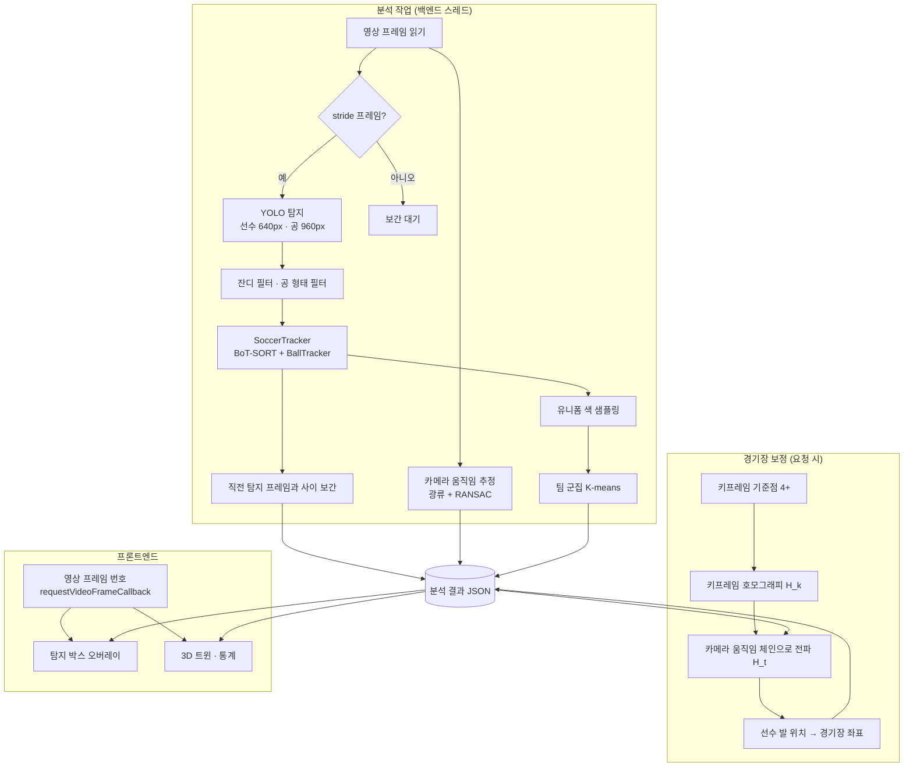

# Soccer 3D Digital Twin — 기술 및 기능 명세 (2부)

## 영상 분석 · 탐지 박스 오버레이 · 움직이는 카메라 경기장 보정 → 3D 트윈 연동

> **이전 문서**: [기술 및 기능 명세 (1부)](./PROJECT_OVERVIEW.md) — 전체 구성, 사용 기술, 탐지·추적·백엔드·프론트엔드 기본 기능
>
> 이 문서는 1부에 이어, 업로드한 **실제 경기 영상**을 분석해 영상 위에 탐지 결과를 표시하고 3D 디지털 트윈과 연동하도록 추가·수정한 내용을 기술과 함께 자세히 정리합니다. 절 번호는 1부(1~6절)에 이어 7절부터 시작합니다.
>
> 작성 기준: 2026-09-28, 브랜치 `feature/digital-twin-video-sync` (커밋 `f903f14`, `a9fbf03`, `0db876a`)

---

## 목차

7. [업데이트 개요](#7-업데이트-개요)
8. [해결해야 했던 문제](#8-해결해야-했던-문제)
9. [전체 처리 흐름](#9-전체-처리-흐름)
10. [영상 분석 기술 상세](#10-영상-분석-기술-상세)
11. [움직이는 카메라 경기장 보정](#11-움직이는-카메라-경기장-보정)
12. [백엔드 분석 API](#12-백엔드-분석-api)
13. [프론트엔드 구현](#13-프론트엔드-구현)
14. [실측 결과](#14-실측-결과)
15. [수정한 버그](#15-수정한-버그)
16. [테스트](#16-테스트)
17. [변경 파일 요약](#17-변경-파일-요약)
18. [남은 제약과 다음 단계](#18-남은-제약과-다음-단계)

---

## 7. 업데이트 개요

1부 시점의 3D 트윈은 백엔드가 만든 **더미 데이터**를 보여 주었고, 분석 파이프라인과 화면은 연결되어 있지 않았습니다. 이번 업데이트로 다음이 가능해졌습니다.

| 기능 | 설명 |
|---|---|
| **업로드 영상 분석** | 버튼 한 번으로 백그라운드 분석 — 선수·공 탐지, 추적, 팀 분류, 카메라 움직임 추정 |
| **탐지 박스 오버레이** | 경기 영상 위에 어떤 선수(`#ID`, 팀 색)와 공(`BALL`)을 인식했는지 **프레임 단위**로 표시 |
| **경기장 보정** | 한 프레임에서 경기장 기준점 4 개 이상을 지정하면, 카메라가 팬·줌해도 **모든 프레임**의 경기장 좌표를 계산 |
| **3D 트윈 연동** | 보정된 선수·공 위치를 영상과 같은 프레임으로 3D 재현, 실제 유니폼 색 사용 |

사용 흐름:

```
영상 업로드 → [분석 시작] → 진행률 표시 → 탐지 박스 표시
           → [경기장 보정] 도면에서 기준점 선택 → 영상에서 같은 지점 클릭 (4 개 이상) → 저장
           → 3D 트윈이 "분석 데이터"로 전환되어 영상과 함께 재생
```

---

## 8. 해결해야 했던 문제

실제 중계 영상(레알 마드리드 vs 바르셀로나, 1920×1080, 30 FPS, 35 초)을 분석하며 확인한 문제와 선택한 해법입니다.

| 문제 | 원인 | 해법 |
|---|---|---|
| 고정 호모그래피로는 좌표가 맞지 않음 | 중계 카메라가 계속 **팬·줌** | 프레임 간 카메라 움직임을 추정하고, 키프레임 보정을 전 프레임에 전파 (11절) |
| 관중석 사람까지 선수로 탐지 | COCO `person` 모델은 관중도 사람 | 선수 발 주변에 잔디가 있는지 검사 (10.3) |
| COCO 공 모델이 사람·의자까지 공 후보로 냄 | 80 개 클래스를 모두 추론 | COCO 모델은 `sports ball` 클래스만 추론 (10.1) |
| 잔디 위 흰 줄이 공으로 탐지 | 작은 흰 물체를 공으로 오인 | 공 박스 가로세로비 검사 (10.3) |
| 카메라가 움직이면 추적 ID 가 자주 바뀜 | 칼만 필터가 카메라 움직임을 모름 | 카메라 움직임 보정(CMC)이 있는 BoT-SORT 채택 (10.4) |
| CPU 에서 프레임당 3.8 초 (35 초 영상에 약 1 시간) | 5 코어 CPU, 두 모델 추론 | 3 프레임마다 탐지 + 박스 보간, 경량 모델 (10.2) |
| 분석 중 같은 PC 의 브라우저가 멈춘 듯 느려짐 | 추론이 CPU 를 모두 점유, 3D 화면이 60 FPS 로 계속 렌더링 | 추론 스레드 제한 + 3D 온디맨드 렌더링 (12.3, 13.6) |

---

## 9. 전체 처리 흐름



---

## 10. 영상 분석 기술 상세

구현: `pipeline/video_analysis.py` — `analyze_video()`

### 10.1 탐지기 개선 — `tracking/detector.py`

**COCO 클래스 필터**

Roboflow 전용 모델이 없으면 COCO 사전학습 YOLO11 이 대체 모델로 쓰입니다. COCO 모델은 80 개 클래스를 탐지하므로, 공 모델로 쓰면 사람·의자·가방도 "공 후보"가 됩니다.

```python
def _coco_class_ids(model, name):
    names = model.names                       # {0: 'person', ..., 32: 'sports ball', ...}
    if 'sports ball' not in names.values():   # 전용 모델(Roboflow) → 필터 없음
        return None
    return [i for i, n in names.items() if n == name]

self.player_classes = _coco_class_ids(self.players_model, 'person')        # [0]
self.ball_classes   = _coco_class_ids(self.ball_model, 'sports ball')      # [32]
```

`predict(classes=...)` 로 전달해 필요한 클래스만 추론합니다. 전용 모델에는 필터를 적용하지 않습니다.

**모델별 추론 해상도**

1080p 중계 화면에서 공은 10~15 px 입니다. 기본 640 px 입력으로 줄이면 3~5 px 이 되어 거의 탐지되지 않으므로, 공 모델만 높은 해상도로 추론합니다.

| 모델 | 설정 | 기본값 |
|---|---|---|
| 선수 | `detection.img_size` | 640 |
| 공 | `analysis.ball_imgsz` | 960 |

### 10.2 탐지 간격(stride)과 박스 보간

CPU 에서 모든 프레임을 탐지하면 너무 느리므로, `stride` 프레임마다 탐지하고 그 사이 프레임은 **양쪽 탐지 프레임에 모두 있는 트랙**의 박스를 선형 보간합니다.

```
프레임:   0      1      2      3      4      5      6
탐지:     ●                    ●                    ●
보간:            ○      ○             ○      ○

box(j) = box(a) + (box(b) − box(a)) · (j − a) / (b − a)
```

- 한쪽에만 있는 트랙(새로 등장·사라짐)은 사이 프레임에 표시하지 않습니다.
- 신뢰도는 두 값 중 작은 값을 씁니다.
- 마지막 프레임은 항상 탐지해 끝부분이 비지 않도록 합니다.
- 카메라 움직임은 탐지와 무관하게 **모든 프레임**에서 계산합니다(비용이 작음).

### 10.3 오탐 필터

**잔디 필터 (관중 제거)**

```python
mask = cv2.inRange(hsv, (30, 40, 40), (90, 255, 255))   # 540p 로 줄인 프레임의 초록 영역
```

선수 발 주변 영역을 박스보다 넓게 잡아 잔디 비율이 15 % 이상인지 확인합니다.

```
검사 영역: 가로 = 박스 폭의 좌우 25 % 확장
          세로 = 박스 하단 위 10 % ~ 아래 15 %
```

처음에는 발밑 좁은 영역만 보았는데, 다른 선수와 겹쳐 발이 가려진 선수가 잘못 제외되었습니다. 영역을 넓혀 주변 잔디로 판정하도록 수정했습니다. 관중석·광고판 위의 사람은 주변에 잔디가 거의 없어 걸러집니다.

**공 형태 필터**

공 박스는 거의 정사각형이므로 가로세로비 `0.6 ≤ w/h ≤ 1.7` 만 공 후보로 받습니다. 실제 영상에서 신뢰도 0.56 으로 탐지된 "공"이 잔디 위 흰 줄(14×7 px)이었던 사례를 이 필터로 제거합니다.

### 10.4 추적 — BoT-SORT + 카메라 움직임 보정

**문제**: ByteTrack 등 칼만 필터 기반 추적기는 "선수가 어디로 움직일지"를 예측해 다음 박스와 매칭합니다. 카메라가 팬하면 화면 속 모든 선수가 한꺼번에 움직이므로 예측이 빗나가고, 트랙을 잃은 뒤 새 ID 를 부여합니다.

**해법**: BoT-SORT 는 매칭 전에 프레임 간 카메라 움직임(CMC, Camera Motion Compensation)을 추정해 예측 박스를 보정합니다. 기본 방식인 ECC 는 느려서 **희소 광류(`sof`)** 를 사용합니다. ReID 가중치는 쓰지 않습니다.

```python
boxmot.BotSort(track_high_thresh=0.3, match_thresh=0.8, track_buffer=30,
               frame_rate=30, use_embeddings=False, cmc_method='sof')
```

실제 영상 비교 결과는 [14.2](#142-추적기-비교)에 있습니다.

**ID 규칙**

| ID | 대상 |
|---|---|
| `0` | 공 (BallTracker, 항상 하나) |
| `1 ~` | 선수 (추적기 ID + 1) |

boxmot 25 는 ID 를 0 부터 매기므로 공 ID 와 겹치지 않도록 모든 추적기 ID 에 1 을 더합니다.

**공 추적 범위**: 탐지 간격이 3 프레임이면 한 번 갱신할 때 공이 3 배 더 움직이므로, BallTracker 의 허용 이동 거리를 `60 × stride` 픽셀로 설정합니다.

### 10.5 카메라 움직임 추정

**원리**: 중계 카메라는 거의 고정된 위치에서 회전(팬·틸트)과 줌만 합니다. 이 경우 카메라에서 보이는 배경 전체(관중석·광고판·잔디)가 **하나의 호모그래피**로 움직입니다. 따라서 배경 점들의 이동으로 프레임 간 변환 `M_t` 를 구할 수 있습니다.

```
p_t = M_t · p_{t−1}      (p: 동차 좌표 픽셀, M_t: 3×3)
```

**절차** (`camera_motion()`)

1. 프레임을 0.5 배(540p)로 줄이고 흑백으로 변환
2. 직전 프레임의 **선수 박스를 가린 마스크**를 만듭니다. 선수는 카메라와 다르게 움직이므로 제외합니다.
3. `goodFeaturesToTrack(maxCorners=500, qualityLevel=0.01, minDistance=8)` 로 배경 특징점 검출
4. `calcOpticalFlowPyrLK` 로 현재 프레임에서 같은 점 추적
5. `findHomography(..., RANSAC, 2.0 px)` 로 이상치를 걸러 `M` 계산
6. 인라이어가 `max(15, 추적된 점의 30 %)` 미만이면 실패(`null`) — 장면 전환·리플레이 컷에서 발생
7. 원본 해상도 기준으로 변환: `M_full = S⁻¹ · M · S` (`S = diag(0.5, 0.5, 1)`)

화면 좌상단 점수판·우상단 로고는 카메라와 함께 움직이지 않지만(화면에 고정), 배경 점보다 훨씬 적어 RANSAC 에서 이상치로 제외됩니다.

### 10.6 팀 자동 분류

**색 샘플링** (`torso_color()`)
- 선수 박스의 **상체 영역**: 세로 20~50 %, 가로 좌우 25 % 안쪽
- 잔디 픽셀을 제외한 평균색을 **Lab 색공간**으로 계산 — Lab 은 사람이 느끼는 색 차이와 거리가 비례해 군집에 적합
- 트랙마다 `3 × stride` 프레임 간격으로 최대 40 개 샘플

**군집** (`cluster_teams()`)
1. 샘플이 3 개 이상인 트랙의 대표색 = 샘플 중앙값
2. `cv2.kmeans(k=2, KMEANS_PP_CENTERS, attempts=5)`
3. 트랙이 많은 군집을 `home`, 나머지를 `away`
4. 소속 군집 중심에서 `max(3 × 중앙 거리, 18)` (Lab 거리) 이상 떨어진 트랙은 `other` — 심판(노란색), 골키퍼, 샘플 부족 트랙
5. 두 군집 중심색을 RGB 로 변환해 `team_colors` 로 저장 → 오버레이 박스와 3D 마커에 실제 유니폼 색 사용

### 10.7 분석 결과 형식

저장 위치: `uploads/analysis/{영상 이름}.json` (35 초 영상 기준 약 340 KB, 보정 후 약 450 KB)

```json
{
  "version": 1,
  "video": "sports_video_1.mp4",
  "fps": 30.0, "width": 1920, "height": 1080,
  "frame_count": 1054, "stride": 3,
  "frames": [
    [[12, 0, 640, 400, 672, 480, 0.71], [0, 1, 818, 638, 835, 652, 0.56]]
  ],
  "motion": [null, [1.0012, 0.0003, -4.21, ...], ...],   // 값은 예시
  "teams": {"12": "home", "7": "away", "3": "other"},
  "team_colors": {"home": "#584648", "away": "#c3ced8"},
  "calibration": {"keyframes": [{"frame": 45, "points": [{"image": [1798, 412], "pitch": [0, 34]}]}]},
  "world": [[[12, -21.9, -8.9], [0, -13.1, -2.1]], null]
}
```

| 필드 | 설명 |
|---|---|
| `frames[t]` | `[track_id, kind(0 선수 · 1 공), x1, y1, x2, y2, conf]` 목록 (원본 픽셀) |
| `motion[t]` | 프레임 t−1 → t 카메라 움직임 3×3 (행 우선 9 개), 실패 시 `null` |
| `world[t]` | 보정 후 `[track_id, x, y]` (미터), 보정이 닿지 않는 프레임은 `null` |

저장은 임시 파일에 쓴 뒤 교체(`Path.replace`)해, 쓰는 도중 읽혀도 깨진 JSON 이 보이지 않습니다.

---

## 11. 움직이는 카메라 경기장 보정

구현: `pipeline/video_analysis.py` — `keyframe_homography()`, `frame_homographies()`, `calibrate()`

### 11.1 좌표계

```
                    y = +34 (화면 먼 쪽 터치라인)
        ┌──────────────────┬──────────────────┐
        │                  │                  │
x = −52.5                (0,0)              x = +52.5
 (왼쪽 골라인)          센터 스폿          (오른쪽 골라인)
        │                  │                  │
        └──────────────────┴──────────────────┘
                    y = −34 (화면 가까운 쪽 터치라인)
```

- 단위 미터, FIFA 표준 105 × 68 m
- 3D 화면(three.js) 변환: `[x, y, z] → [x, z(높이), −y]`

### 11.2 키프레임 호모그래피

사용자가 키프레임 k 에서 기준점 n 개(n ≥ 4)의 `(이미지 픽셀, 경기장 좌표)` 쌍을 지정하면 `cv2.findHomography(image, pitch, 0)` (최소제곱)으로 이미지 → 경기장 변환 `H_k` 를 구합니다. 점이 4 개 미만이거나, 한 직선 위에 있어 행렬식이 0 에 가까우면 거부합니다(API 400).

**기준점 31 개** (`frontend/src/analysis.js` — `LANDMARKS`)

| 구분 | 기준점 | 경기장 좌표 |
|---|---|---|
| 중앙 | 센터 스폿 | (0, 0) |
| | 하프라인 × 위/아래 터치라인 | (0, ±34) |
| | 센터서클 × 하프라인 위/아래 | (0, ±9.15) |
| 좌·우 각각 | 코너 위/아래 | (±52.5, ±34) |
| | 페널티박스 × 골라인 위/아래 | (±52.5, ±20.16) |
| | 페널티박스 앞 모서리 위/아래 | (±36, ±20.16) |
| | 페널티 아크 × 박스선 위/아래 | (±36, ±7.31) |
| | 골에어리어 × 골라인 위/아래 | (±52.5, ±9.16) |
| | 골에어리어 앞 모서리 위/아래 | (±47, ±9.16) |
| | 페널티 스폿 | (±41.5, 0) |

페널티 아크와 박스선 교점은 중계 화면에서 자주 보이는 점이라 추가했습니다. 페널티 스폿에서 반지름 9.15 m 원이 스폿에서 5.5 m 떨어진 박스선과 만나므로 `√(9.15² − 5.5²) ≈ 7.31 m` 입니다.

### 11.3 전 프레임 전파

키프레임 k 의 보정을 카메라 움직임 체인으로 다른 프레임 t 에 전달합니다.

```
t > k (이후 프레임):  p_k = M_{k+1}⁻¹ ··· M_t⁻¹ · p_t
                     H_t = H_k · M_{k+1}⁻¹ ··· M_t⁻¹

t < k (이전 프레임):  p_k = M_k ··· M_{t+1} · p_t
                     H_t = H_k · M_k ··· M_{t+1}
```

- 키프레임이 여러 개이면 프레임마다 **체인 길이가 가장 짧은(가장 가까운) 키프레임**을 사용합니다.
- `M_t` 가 `null` 인 곳(장면 전환)에서 전파를 멈춥니다. 컷 너머 구간은 그 구간에 키프레임을 추가해야 합니다.
- 계산량은 키프레임 수 × 프레임 수의 3×3 행렬 곱으로 매우 작습니다(보정 저장 즉시 계산).

### 11.4 경기장 좌표 계산

- **지면 접점**: 선수는 발이 땅에 닿으므로 박스 **하단 중앙**을 사용합니다. 박스 중심을 쓰면 원근 때문에 선수가 실제보다 멀리 있는 것으로 계산됩니다. 공도 지면에 있다고 가정해 하단 중앙을 씁니다.
- `cv2.perspectiveTransform(발 위치들, H_t)` 로 한 프레임을 한 번에 변환
- 경기장 밖 5 m 이상 벗어난 좌표는 제외합니다. 스로인 등 라인 밖 선수는 허용하고, 보정 오차로 크게 튄 값은 제거합니다.

---

## 12. 백엔드 분석 API

구현: `backend/server.py`

### 12.1 엔드포인트

| 메서드 | 경로 | 요청 / 응답 |
|---|---|---|
| `POST` | `/analysis/{name}` | 분석 시작 → `{state: "queued"}`. 이미 진행 중이면 409, 영상이 없으면 404 |
| `GET` | `/analysis/{name}/status` | `{state, progress, calibrated?, error?}` |
| `GET` | `/analysis/{name}` | 분석 결과 JSON (없으면 404) |
| `POST` | `/analysis/{name}/calibration` | `{keyframes: [{frame, points: [{image: [u, v], pitch: [x, y]}]}]}` → `{calibrated_frames, frame_count}` |

**작업 상태**

```
none ──POST──▶ queued ──▶ running (progress 0 → 1) ──▶ done
                                  └──(예외)──▶ error ──POST──▶ queued
```

### 12.2 작업 처리 방식

- `ThreadPoolExecutor(max_workers=1)` — CPU 추론은 동시에 돌리면 서로 느려지기만 하므로 한 번에 하나씩 처리합니다.
- 탐지 모델은 **첫 분석 때 한 번만** 로드해 재사용합니다. 추적기는 영상마다 새로 만들어 ID 를 1 부터 시작합니다.
- 진행률은 작업 스레드가 프레임마다 갱신하고, 프론트엔드가 1.5 초마다 조회합니다.
- 영상 이름은 `Path(name).name` 으로 정규화해 경로 조작(`../`)을 막습니다.
- 진행 중 작업 상태는 메모리에만 있습니다. 서버를 재시작하면 진행 중 작업은 사라지지만 완료된 결과는 파일로 남습니다.

### 12.3 CPU 자원 제한

분석 중 같은 PC 의 브라우저와 API 가 멈춘 듯 느려지는 현상을 확인했습니다(14.5). 추론·영상 처리 스레드를 `CPU 코어 수 − 2` 로 제한해 UI 와 서버가 쓸 코어를 남깁니다.

```python
threads = max(1, os.cpu_count() - 2)
torch.set_num_threads(threads)
cv2.setNumThreads(threads)
```

### 12.4 설정 — `configs/model_config.yaml`

```yaml
detection:
  model_path: "models/yolo11n.pt"   # CPU 기본값 (GPU 는 yolo11s 권장)
  img_size: 640
  confidence_threshold: 0.25
  device: "cpu"

analysis:
  stride: 3          # N 프레임마다 탐지 (GPU 면 1)
  ball_imgsz: 960

tracking:
  type: "botsort"    # botsort | bytetrack | simple
  track_threshold: 0.3
  match_threshold: 0.8
  max_age: 30
```

1부에서 알려진 이슈였던 설정 키 불일치(파이프라인이 `tracker`·`gaussian` 키를 읽어 YAML 의 `tracking`·`gaussian_splatting` 이 무시됨)도 이번에 수정했습니다. 이전 키도 호환합니다.

---

## 13. 프론트엔드 구현

### 13.1 파일 구성

| 파일 | 역할 |
|---|---|
| `src/App.jsx` | 분석 상태·결과 로드, 영상 프레임 추적, 3D 데이터 소스 전환, 분석 카드, 보정 흐름 |
| `src/components/VideoOverlay.jsx` | 영상 위 canvas — 탐지 박스, 보정점, 보정 클릭 처리 |
| `src/components/CalibrationPanel.jsx` | 탑다운 경기장 SVG 도면, 기준점 선택·목록·저장 |
| `src/analysis.js` | 기준점 목록, 분석 프레임 → 3D 데이터 변환, 레터박스 좌표, 글자색 계산 |
| `src/components/api.js` | 분석 API 클라이언트 (`startAnalysis`, `getAnalysisStatus`, `getAnalysis`, `saveCalibration`) |

### 13.2 프레임 단위 동기화

탐지 박스가 영상과 어긋나지 않으려면 **지금 화면에 표시된 영상 프레임 번호**를 정확히 알아야 합니다. `timeupdate` 이벤트는 초당 4 번 정도만 발생하고, WebSocket 스트림은 네트워크 지연이 있습니다.

`HTMLVideoElement.requestVideoFrameCallback()` 은 새 영상 프레임이 화면에 표시될 때마다 그 프레임의 미디어 시각(`mediaTime`)을 알려 줍니다.

```js
const onFrame = (_, meta) => {
  setVideoFrame(Math.round(meta.mediaTime * fps))   // 분석 결과 frames[] 인덱스와 일치
  handle = video.requestVideoFrameCallback(onFrame)
}
```

- 탐색(`seeked`) 직후에도 프레임 번호를 갱신합니다.
- 지원하지 않는 브라우저는 `timeupdate` 로 대체합니다.
- 분석 결과는 처음에 한 번 받아 브라우저에 두고, 프레임 번호로 바로 조회합니다. 재생 중 네트워크 요청이 없습니다.

### 13.3 탐지 박스 오버레이

영상은 `object-fit: contain` 으로 표시되어 위아래(또는 좌우)에 검은 여백이 생깁니다. 원본 픽셀 좌표를 화면 좌표로 바꾸려면 실제 영상이 그려진 영역을 계산해야 합니다.

```js
scale = min(화면폭 / 영상폭, 화면높이 / 영상높이)
offsetX = (화면폭 − 영상폭 × scale) / 2
offsetY = (화면높이 − 영상높이 × scale) / 2
화면 좌표 = offset + 원본 좌표 × scale
```

- canvas 크기는 `devicePixelRatio` 를 반영해 고해상도 화면에서도 선명하게 그립니다.
- 선수: 팀 색 사각형 + `#ID` 라벨(배경 밝기에 따라 글자색 자동 선택)
- 공: 강조색 원 + `BALL` 라벨
- 팀 `other`(심판 등)는 회색
- 크기 변화는 `ResizeObserver` 로 감지하고, 첫 크기는 마운트 즉시 측정합니다.

### 13.4 보정 도구

1. **경기장 보정**을 누르면 영상이 일시정지되고, 현재 프레임이 키프레임이 됩니다.
2. 오른쪽 패널의 **탑다운 경기장 SVG 도면**에서 기준점(점 31 개)을 클릭해 선택합니다.
3. 영상에서 같은 지점을 클릭하면, 화면 좌표를 13.3 의 역변환으로 원본 픽셀 좌표로 바꿔 저장합니다.
4. 찍은 점은 영상 위와 도면에 표시되며 목록에서 삭제할 수 있습니다.
5. 4 개 이상이면 **보정 저장** — 저장 직전에 서버의 최신 키프레임 목록을 다시 받아, 같은 프레임은 교체하고 다른 프레임의 보정은 유지합니다. 다른 창에서 저장한 보정을 덮어쓰지 않기 위해서입니다.

### 13.5 3D 데이터 소스와 속도 계산

| 상황 | 3D 데이터 | 3D 창 라벨 |
|---|---|---|
| 분석 + 보정된 영상 | 분석 결과 `world[프레임]` | 분석 데이터 |
| 분석됐지만 보정 전 | 없음 (보정 안내 표시) | 보정 필요 |
| 보정이 끊긴 구간 (장면 전환) | 없음 (안내 문구) | 분석 데이터 |
| 분석 전 영상 / 영상 없음 | WebSocket 더미 스트림 | 더미 데이터 |

**속도**: 같은 트랙의 6 프레임(0.2 초) 전 경기장 좌표와의 거리 ÷ 0.2 초. 보정 오차나 박스 흔들림으로 튀는 값은 사람 최고 속력(약 12.4 m/s)을 고려해 12 m/s 로 제한해 표시합니다.

### 13.6 3D 온디맨드 렌더링

React Three Fiber 는 기본적으로 60 FPS 로 계속 다시 그립니다. 정지 화면에서도 코어 하나 가까이 쓰며, 분석 작업과 CPU 를 다툽니다.

```jsx
<Canvas frameloop="demand" ...>
```

- 데이터(선수 위치)가 바뀌어 React 가 다시 렌더링되거나 카메라를 조작할 때만 다시 그립니다.
- 카메라 시점 프리셋을 바꿀 때는 `invalidate()` 로 직접 다시 그리기를 요청합니다.

---

## 14. 실측 결과

측정 환경: Windows 11, CPU 5 코어, GPU 없음, PyTorch 2.14 CPU, 영상 1920×1080 30 FPS 35 초(1,054 프레임)

### 14.1 탐지 속도 (프레임 1장)

| 모델 · 해상도 · 클래스 | 시간 | 결과 |
|---|---|---|
| yolo11s · 640 · person | 1,566 ms | 사람 12 |
| yolo11n · 1280 · sports ball | 2,654 ms | 공 후보 3 (확대 확인한 후보는 모두 오탐) |
| yolo11s · 960 · person + ball | 5,050 ms | 사람 8, 공 후보 1 (오탐) |
| yolo11n · 960 · person + ball | 1,720 ms | 사람 11, 공 후보 1 (오탐) |

- 선수 탐지는 yolo11n 이 yolo11s 와 비슷하면서 약 3 배 빨라 CPU 기본값으로 정했습니다.
- 확대 확인 결과 이 프레임의 실제 공은 어느 설정에서도 탐지되지 않았습니다. COCO 범용 모델의 한계입니다(18절).

### 14.2 추적기 비교

같은 탐지 결과(3 프레임 간격 25 회 갱신)를 세 추적기에 입력해 비교했습니다.

| 추적기 | 탐지 대비 출력 비율 | 고유 ID 수 | 갱신당 시간 |
|---|---|---|---|
| SimpleTracker (IoU) | 1.00 | 114 | 1 ms |
| ByteTrack | 0.67 | 39 | 486 ms |
| **BoT-SORT + 희소 광류 CMC** | **0.88** | **22** | 201 ms |

- IoU 추적기는 모든 탐지를 출력하지만 카메라가 움직이면 ID 가 계속 바뀌어 선수 식별에 쓸 수 없습니다.
- ByteTrack 은 카메라 움직임 때문에 트랙을 자주 잃어 출력 비율이 낮습니다.
- BoT-SORT 는 가장 적은 ID 로 대부분의 탐지를 유지합니다.

### 14.3 전체 분석 결과

| 항목 | 값 |
|---|---|
| 처리 방식 | stride 3 (352 회 탐지 + 보간) |
| 프레임당 평균 선수 | 8.3 명 |
| 선수 트랙 | 64 개 (3 초 이상 유지 38 개) |
| 팀 분류 | home 25 · away 25 · other 12 |
| 유니폼 색 | home `#584648` (바르셀로나 짙은 색) · away `#c3ced8` (레알 마드리드 흰색) |
| 카메라 움직임 추정 | 1,053 / 1,054 프레임 (프레임 0 은 이전 프레임이 없음) |
| 공 검출 | 200 프레임 (19 %) |
| 결과 파일 | 약 340 KB |

### 14.4 보정 정확도와 누적 오차

**키프레임 정확도** — 실제 화면에서 기준점을 확대해 찾은 픽셀로 계산:

| 키프레임 | 기준점 | 재투영 오차 |
|---|---|---|
| 프레임 0 | 하프라인 × 터치라인, 센터서클 × 하프라인 위·아래, 왼쪽 페널티박스 앞 모서리, 페널티 아크 × 박스선 | 최대 0.15 m |
| 프레임 720 | 오른쪽 위 코너, 페널티박스 앞 모서리, 페널티박스 × 골라인, 골에어리어 앞 모서리, 골에어리어 × 골라인 | 최대 0.15 m |

**전파 범위** — 경기장 안(±5 m 여유)에 들어온 선수 비율:

| 시점 | 키프레임 1 개 (0) | 키프레임 2 개 (0, 720) |
|---|---|---|
| 0 초 | 14 / 14 | 14 / 14 |
| 10 초 | 10 / 10 | 10 / 10 |
| 16 초 | 5 / 5 | 5 / 5 |
| 20 초 | **1 / 7** | 7 / 7 |
| 25 초 | **6 / 14** | 14 / 14 |
| 30 초 | 6 / 6 | 6 / 6 |
| 35 초 | 2 / 4 | 0 / 4 |

- 카메라 움직임을 프레임마다 곱해 나가므로, 키프레임에서 멀어지고 **줌이 빠르게 바뀌는 구간**(20~25 초)에서 오차가 누적됩니다.
- 해당 구간에 키프레임을 하나 추가하자 0~30 초 전체가 경기장 안으로 들어왔습니다. 마지막 구간은 두 키프레임에서 모두 멀어 추가 보정이 필요합니다.

**선수 속도 분포** (키프레임 1 개, 경기장 안 좌표 기준): 중앙값 4.6 m/s, 상위 10 % 10.5 m/s, 12 m/s 초과 7.4 % — 실제보다 다소 높게 나오며, 보정 오차와 박스 흔들림이 원인입니다.

### 14.5 분석 중 CPU 경합

분석을 켠 채 브라우저에서 3D 화면을 열자 페이지 스크립트가 수십 초씩 응답하지 않았습니다. 프로세스별 CPU 사용량을 측정한 결과입니다.

| 상태 | 분석 프로세스 | 브라우저 (3D 탭 2 개) |
|---|---|---|
| 3D 탭을 연 상태 | 0.18 코어 | 약 2.5 코어 |
| 3D 탭을 닫은 뒤 | 1.13 코어 | — |

- 3D 화면이 60 FPS 로 계속 렌더링하며 CPU 를 많이 쓰고, 분석 추론이 나머지 코어를 모두 쓰려 해 양쪽이 모두 느려졌습니다.
- 대응: 3D 온디맨드 렌더링(13.6), 추론 스레드 제한(12.3)

---

## 15. 수정한 버그

| # | 위치 | 증상 | 원인 | 수정 |
|---|---|---|---|---|
| 1 | `tracker.py` | 공과 첫 번째 선수가 같은 ID(0) | boxmot 25 는 추적 ID 를 0 부터 매김 (이전에는 1 부터로 가정) | 추적기 ID 에 +1 |
| 2 | `tracker.py` | `bytetrack` 설정이 실제로는 IoU 추적기로 동작 | boxmot 25 에서 클래스 이름이 `BYTETracker` → `ByteTrack` 으로 바뀌어 예외 후 대체 | 신·구 클래스 이름 모두 지원 |
| 3 | `main_pipeline.py` | 설정 파일의 추적·3DGS 설정이 무시됨 | 코드가 `tracker`·`gaussian` 키를 읽음 | `tracking`·`gaussian_splatting` 키 사용 (이전 키 호환) |
| 4 | `detector.py` | 공 모델이 사람·의자를 공 후보로 냄 | COCO 80 개 클래스 전체 추론 | COCO 모델은 필요한 클래스만 추론 |
| 5 | `video_analysis.py` | 다른 선수와 겹친 선수가 관중으로 제외됨 | 발밑 좁은 영역만 잔디 검사 | 검사 영역 확대, 비율 기준 조정 |
| 6 | 프론트엔드 · 백엔드 | 분석 중 브라우저가 멈춘 듯 느려짐 | 추론이 CPU 전부 점유 + 3D 60 FPS 상시 렌더링 | 스레드 제한 + 온디맨드 렌더링 |
| 7 | `App.jsx` | 보정을 저장하면 다른 창에서 저장한 키프레임이 사라짐 | 페이지를 열 때 받은 목록 기준으로 전체 교체 | 저장 직전 최신 목록을 다시 받아 병합 |
| 8 | `VideoOverlay.jsx` | 오버레이 canvas 가 기본 크기(300×150)에 머무름 | 첫 크기를 `ResizeObserver` 콜백에만 의존 (숨겨진 탭에서는 호출되지 않음) | 마운트 즉시 크기 측정 |

---

## 16. 테스트

```bash
python -m pytest tests -q        # 35 passed
```

YOLO·GPU 없이 **합성 영상**과 **가짜 탐지기**로 분석·보정 로직을 수 초 안에 검증합니다.

### `tests/test_analysis.py` (신규 12 개)

| 테스트 | 검증 내용 |
|---|---|
| `test_camera_motion_recovers_pan` | 노이즈 텍스처를 (8, 4) px 팬한 합성 영상에서 움직임을 1 px 이내로 복원 |
| `test_camera_motion_fails_on_scene_cut` | 전혀 다른 화면(장면 전환)이면 `None` |
| `test_frame_homographies_propagate_both_ways_and_stop_at_cut` | 앞·뒤 전파 수식, 움직임이 끊긴 곳에서 전파 중단 |
| `test_nearest_keyframe_wins` | 가장 가까운 키프레임 선택 |
| `test_calibrate_maps_feet_and_filters_off_pitch` | 발 위치 → 경기장 좌표, 경기장 밖 객체 제외 |
| `test_calibrate_rejects_bad_points` | 점 3 개, 일직선 점 거부 |
| `test_interpolate_objects_only_shared_tracks` | 양쪽 프레임 공통 트랙만 보간 |
| `test_plausible_ball_and_on_grass` | 공 형태, 잔디 위·관중석 판정 |
| `test_cluster_teams_two_kits_and_outlier` | 두 유니폼 군집, 심판·샘플 부족은 `other` |
| `test_analyze_video_with_stride_interpolates` | 합성 영상에서 stride 4 — 탐지 3 회, 사이 보간, 공 ID 0 |
| `test_analysis_api_flow` | 분석 시작 → 완료 → 결과 → 보정 → 좌표, 잘못된 보정 400 |
| `test_analysis_rejects_unknown_and_traversal` | 없는 영상 404, 경로 조작 차단 |

### `tests/test_core.py` (추가 1 개)

- `test_coco_class_filter_only_for_generic_models` — COCO 모델만 클래스 필터 적용, 전용 모델은 필터 없음

### 실제 영상 검증 (수동)

- 탐지 결과를 영상 프레임에 그려 선수 인식·관중 제외·팀 분류를 육안 확인
- 브라우저에서 분석 카드 → 보정 도구(기준점 5 개 클릭) → 저장 → 3D 데이터 소스 전환까지 실제 UI 이벤트로 확인
- 화면 클릭 → 원본 픽셀 좌표 변환 오차 1~3 px (858 px 폭 표시 기준, 표시 해상도 한계)

---

## 17. 변경 파일 요약

| 파일 | 변경 |
|---|---|
| `pipeline/video_analysis.py` | **신규** — 분석·필터·카메라 움직임·팀 분류·보정 전파·저장 |
| `pipeline/main_pipeline.py` | `initialize_detector()`, `make_tracker()` 분리, 설정 키 수정, 추론 해상도 전달 |
| `tracking/detector.py` | COCO 클래스 필터, 모델별 추론 해상도 |
| `tracking/tracker.py` | boxmot 25 대응, BoT-SORT CMC 기본값, 추적 ID +1 |
| `backend/server.py` | 분석·보정 API, 작업 실행기, 추론 스레드 제한 |
| `configs/model_config.yaml` | `analysis` 섹션, 추적기 `botsort`, CPU 기본 모델 `yolo11n` |
| `frontend/src/App.jsx` | 분석 상태·프레임 추적·3D 데이터 소스·분석 카드·보정 흐름·온디맨드 렌더링 |
| `frontend/src/components/VideoOverlay.jsx` | **신규** — 탐지 박스·보정점 canvas |
| `frontend/src/components/CalibrationPanel.jsx` | **신규** — 경기장 도면 보정 패널 |
| `frontend/src/analysis.js` | **신규** — 기준점, 3D 변환, 좌표 계산 |
| `frontend/src/components/api.js` | 분석 API 함수 |
| `frontend/src/index.css` | 오버레이·분석 카드·진행 막대·스위치·보정 패널 스타일 |
| `tests/test_analysis.py` | **신규** — 12 개 테스트 |
| `README.md`, `docs/PROJECT_OVERVIEW.md` | 사용법·구성·현황 갱신 |

---

## 18. 남은 제약과 다음 단계

### 18.1 제약

| 구분 | 내용 |
|---|---|
| 분석 속도 | CPU 5 코어에서 약 1 초/프레임 — 35 초 영상에 수십 분 |
| 공 검출 | COCO 범용 모델로는 19 % 프레임에서만 검출, 오탐도 있음 |
| 보정 | 수동 기준점 지정 필요, 키프레임에서 멀수록 오차 누적 |
| 팀 분류 | 골키퍼·심판·짧은 트랙은 `other` |
| 속도 수치 | 보정 오차로 다소 높게 계산됨 |
| 작업 관리 | 진행 중 작업은 서버 재시작 시 사라짐, 작업 취소 없음 |
| 공 높이 | 공이 지면에 있다고 가정 — 공중볼은 위치가 어긋남 |

### 18.2 다음 단계 (우선순위순)

| 순서 | 작업 | 효과 | 구현 방향 |
|---|---|---|---|
| 1 | **자동 경기장 보정** | 수동 보정 제거, 누적 오차·장면 전환 해결 | 경기장 키포인트 검출 모델(Roboflow football-field 데이터셋) 학습 → 일정 간격 자동 키프레임 → 현재 `frame_homographies()` 에 그대로 입력 |
| 2 | **공 전용 탐지 모델** | 공 검출률·정확도 향상 | football-ball 데이터셋 학습, 고해상도 타일 추론(SAHI), 궤적 보간 |
| 3 | **GPU 추론** | 분석 시간 수십 배 단축 | `device: cuda`, `stride: 1`, TensorRT/OpenVINO 내보내기 |
| 4 | **분석 중 부분 결과 표시** | 긴 분석 중에도 앞부분 확인 | 주기적 부분 저장 + 프론트엔드 점진 로드 |
| 5 | **좌표 평활화** | 속도·궤적 안정화 | 트랙별 칼만 필터로 경기장 좌표 평활화 |
| 6 | **분석 기능** | 전술 분석 | 히트맵, 이동 거리·스프린트, 패스 네트워크, 오프사이드 라인 ([1부 6.2](./PROJECT_OVERVIEW.md#62-2단계--분석-기능)) |
