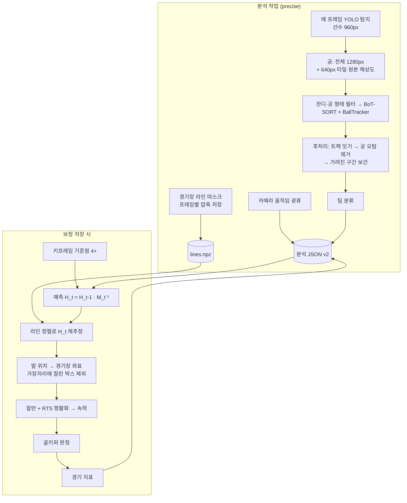

# Soccer 3D Digital Twin — 기술 및 기능 명세 (4부)

## 고정밀 분석 모드 — 경기장 라인 정렬 보정 · 오프라인 후처리 · 경기 지표

> **이전 문서**: [1부](./PROJECT_OVERVIEW.md) — 전체 구성 · [2부](./PROJECT_OVERVIEW_2_VIDEO_ANALYSIS.md) — 영상 분석·보정·3D 연동 · [3부](./PROJECT_OVERVIEW_3_VLM.md) — CV 고도화·VLM 설계
>
> 3부 23.2절에서 실행 모드를 **실시간**과 **정밀 분석**으로 나누기로 했습니다. 이 문서는 그중 **정밀 분석 모드를 먼저 구현**한 내용입니다. GPU 없는 CPU 환경에서 바로 돌아가는 범위로 만들되, RF-DETR·SAM3·SigLIP2·VLM 등 최종 목표의 구성 요소가 그대로 끼워질 수 있도록 구조를 잡았습니다. 절 번호는 3부(19~27절)에 이어 28절부터 시작합니다.
>
> 작성 기준: 2026-10-01

---

## 목차

28. [방향: 실시간보다 정밀](#28-방향-실시간보다-정밀)
29. [고정밀 모드 구성](#29-고정밀-모드-구성)
30. [경기장 라인 정렬 보정](#30-경기장-라인-정렬-보정)
31. [오프라인 후처리](#31-오프라인-후처리)
32. [경기 지표](#32-경기-지표)
33. [API · 데이터 형식](#33-api--데이터-형식)
34. [프론트엔드](#34-프론트엔드)
35. [검증 — 정답이 있는 합성 중계 영상](#35-검증--정답이-있는-합성-중계-영상)
36. [한계와 다음 단계](#36-한계와-다음-단계)

---

## 28. 방향: 실시간보다 정밀

| 판단 근거 | 내용 |
|---|---|
| 하드웨어 | CPU 전용 환경에서 YOLO11n 만으로 약 1 초/프레임 — 실시간(30 FPS)은 30 배 이상 부족 |
| 업로드 영상 | 분석 대상은 이미 녹화된 영상 → **영상 전체를 보고** 판단할 수 있음 (실시간 추적기는 과거 프레임만 봄) |
| 트윈·지표·VLM 의 품질 | 3부 19절 결론대로 결과 품질은 **좌표·ID 데이터 품질**이 결정 — 속도보다 정확도가 우선 |
| 2부 실측 문제 | 키프레임에서 멀어질수록 보정 오차 누적(20~25 초 구간 선수 대부분이 경기장 밖으로 계산됨), 속력 과대(중앙값 4.6 m/s, 12 m/s 초과 7.4 %), ID 가 쪼개짐 |

따라서 기본 분석 모드를 **고정밀(precise)** 로 바꾸고, 기존 동작은 **빠른 미리보기(realtime)** 로 남겼습니다. 정밀 모드는 백그라운드 작업이라 느려도 UI 는 막히지 않으며, 진행 중 **취소**할 수 있습니다.

---

## 29. 고정밀 모드 구성



설정 `configs/model_config.yaml`:

| 항목 | realtime | **precise** | 효과 |
|---|---|---|---|
| `stride` | 3 | **1** | 보간 없이 매 프레임 탐지 |
| `img_size` (선수) | 640 | **960** | 멀리 있는 작은 선수 |
| `ball_imgsz` | 960 | **1280** | 작은 공 |
| `ball_tile` | 끔 | **640** | 원본 해상도 타일 추론 (SAHI 방식) |
| `postprocess` | 끔 | **켬** | 트랙 잇기·보간·공 정리 (31절) |
| `line_refine` | 끔 | **켬** | 보정 시 라인 정렬 (30절) |
| 보정 후 평활화·지표 | 없음 | **있음** | 31.4절, 32절 |

`Soccer3DPipeline.analysis_profile(mode)` 가 `analysis` 섹션과 `profiles.<mode>` 를 합쳐 돌려주고, 백엔드는 탐지 모델을 다시 만들지 않고 **추론 설정만 바꿔** 재사용합니다.

### 29.1 공 타일 추론 — `tracking/detector.py`

중계 화면의 공은 10~15 px 로, 전체 화면을 축소해 추론하면 몇 픽셀로 줄어 사라집니다(2부: 공 검출 19 %). 정밀 모드는 전체 화면 추론에 더해 **640 px 정사각 타일을 20 % 겹쳐** 원본 해상도로 추론하고, 결과를 프레임 좌표로 되돌린 뒤 NMS 로 중복을 제거합니다(`tiles()`, `merge_detections()`). 1080p 는 4 × 2 = 8 타일입니다. COCO 모델이면 `sports ball` 클래스만 추론하는 기존 필터가 그대로 적용됩니다. 3부의 RF-DETR·공 전용 모델로 바꿔도 같은 타일 경로를 씁니다.

---

## 30. 경기장 라인 정렬 보정

구현: `pipeline/pitch.py`

### 30.1 문제

기존 보정은 키프레임 호모그래피 `H_k` 에 프레임 간 카메라 움직임 `M_t` 를 계속 곱합니다. 각 `M_t` 의 작은 오차가 곱해져 쌓이므로 키프레임에서 멀수록, 줌이 빠를수록 틀어집니다. 사용자가 키프레임을 여러 개 찍는 것이 유일한 대응이었습니다.

### 30.2 방법 — 매 프레임 라인에 다시 맞추기

전파된 값은 **초기값으로만** 쓰고, 매 프레임 화면에 보이는 흰 라인에 FIFA 규격 라인 모델을 다시 정렬합니다. 오차가 다음 프레임으로 넘어가지 않으므로 누적되지 않습니다.

```
H_t(예측) = H_{t-1} · M_t⁻¹         ← 카메라 움직임 (앞으로; 뒤로는 H_{t+1} · M_{t+1})
H_t       = refine(H_t(예측), 라인 마스크_t)
```

| 단계 | 함수 | 내용 |
|---|---|---|
| 라인 모델 | `pitch_polylines()`, `sample_pitch_lines()` | 터치·골·하프라인, 센터서클, 페널티·골 에어리어, 페널티 아크 → 0.5 m 간격 샘플점 + 접선 방향 |
| 경기장 영역 | `pitch_region()` | 잔디 마스크 → 열림(관중석의 초록 점 제거) → 닫힘 → 큰 연결 영역 → 구멍 채우기 |
| 라인 픽셀 | `line_mask()` | 그레이 top-hat(주변보다 밝고 얇은 구조) → **능선(중심선)만** 남김 → 경기장 영역 안 → 선수 박스 제외(흰 유니폼 오검출 방지) |
| 대응 | `LineRefiner.refine()` | 모델점을 현재 추정으로 투영 → 거리 변환으로 가장 가까운 라인 픽셀 찾기 (반경 12 → 6 → 3 px 로 좁혀 3 회 반복) |
| 최적화 | 〃 | 8 개 매개변수 호모그래피 보정을 **점-직선 거리**(모델 접선의 수직 방향)로 최소화, `scipy.optimize.least_squares` soft-L1 강건 손실 |
| 안정화 | 〃 | 화면 격자 9 점이 예측에서 벗어나는 만큼 약한 prior 비용 — 라인이 한 방향만 보일 때 미끄러짐 방지 |

**채택 조건** (하나라도 어기면 예측값을 그대로 쓰고 다음 프레임에서 다시 시도)

1. 라인과 1.5 px 이내로 맞은 모델점이 40 개 이상
2. 정렬 비율(보이는 모델점 중 맞은 비율)이 예측값보다 나빠지지 않음
3. 맞은 점들의 접선 방향이 **두 방향 이상** (방향 공분산 고윳값 비 ≥ 0.04) — 한 직선만 보이면 호모그래피가 결정되지 않으므로 거부
4. 한 번의 정렬로 화면 모서리가 화면 폭 8 % 이상 움직이지 않음

> 처음 구현에서는 굵은 라인의 **가장자리** 픽셀에 맞아 0.1 m 정도 치우쳤습니다. 능선 검출로 중심선만 남기고, 축소 영상의 픽셀 중심 규약(`x_s = s·(x + 0.5) − 0.5`, `scale_matrix()`)을 반영해 오차를 0.02 m 수준으로 낮췄습니다.

### 30.3 저장과 비용

- 분석(precise) 중 카메라 움직임 계산에 쓰는 540p 축소 프레임으로 라인 마스크를 함께 만들어 `uploads/analysis/{영상}.lines.npz` 에 비트 압축 저장 (`LineMaskStore`). 합성 영상 기준 프레임당 약 1.5 KB.
- 보정 저장 시 영상을 다시 읽지 않고 이 파일로 정렬합니다. 정렬 비용은 프레임당 약 20 ms (4 코어 CPU).
- 키프레임 자체도 정렬합니다 — 사용자의 클릭 오차(1~3 px)를 라인이 보정합니다.
- 프레임별 정렬 비율은 `calibration.line_fit`, 프레임별 최종 호모그래피는 `homographies` 에 저장됩니다.

---

## 31. 오프라인 후처리

구현: `pipeline/postprocess.py`. 실시간 추적기는 과거 프레임만 보고 즉시 결정하지만, 업로드 영상은 전체를 다시 볼 수 있습니다.

모든 단계는 `MotionChain` 으로 **카메라 움직임을 제거한 좌표**(장면 전환 없는 구간의 첫 프레임 좌표)에서 계산합니다. 화면상 이동과 실제 이동을 구분하기 위해서입니다.

### 31.1 트랙 잇기 — `stitch_tracks()`

가려짐으로 BoT-SORT 의 `track_buffer`(30 프레임)보다 오래 사라지면 같은 선수가 새 ID 로 돌아옵니다.

| 조건 | 기준 |
|---|---|
| 시간 | 조각 A 가 끝나고 1.5 초 이내에 조각 B 시작, 겹치지 않음, 같은 장면 구간 |
| 위치 | A 의 끝 위치·속도로 예측한 위치와 B 시작 위치(또는 그 반대)의 거리 ≤ 선수 키 × (0.6 + 1.2 × 공백 초) |
| 크기 | 박스 키 비율 0.67 ~ 1.5 |
| 외형 | 유니폼 Lab 색 거리 ≤ 28 (색 샘플이 있을 때) |

비용 = 거리/키 + 색 거리/40 + 0.3 × 공백 초. 모든 후보를 **헝가리안 알고리즘**으로 1:1 배정하고, A→B→C 사슬은 가장 먼저 시작한 ID 로 통일합니다. 유니폼 색 샘플도 합쳐 팀 분류가 더 안정됩니다(짧은 트랙이 줄어 `other` 감소).

### 31.2 보간 · 공 정리

| 함수 | 내용 |
|---|---|
| `fill_gaps()` | 같은 트랙의 공백(선수 1.5 초, 공 0.7 초 이하)을 채움. 양 끝 박스를 **카메라 움직임을 따라** 해당 프레임으로 옮긴 뒤 시간 가중 평균 — 화면 좌표 선형 보간과 달리 카메라가 팬해도 맞음. 보간 박스는 신뢰도 0 (영상 위에 점선으로 표시) |
| `clean_ball()` | 앞뒤 공 위치를 잇는 선에서 크게 벗어나고 앞뒤 두 점은 서로 가까운 경우(혼자 튄 오탐) 삭제 |

### 31.3 가장자리에 잘린 박스 제외 — `clipped_by_border()`

화면 좌·우·아래 가장자리에 닿은 선수 박스는 발 위치(하단 중앙)가 실제와 다르므로 경기장 좌표 계산에서 뺍니다. UI 검증 중 화면 끝에 반쯤 걸친 심판이 11 m/s "스프린트"로 잡힌 것을 보고 추가했습니다. 모든 모드에 적용됩니다.

### 31.4 좌표 평활화 — `smooth_world()`, `rts_smooth()`

트랙마다 **등속 모델 칼만 필터 + Rauch-Tung-Striebel 역방향 평활화**를 적용합니다(1 초 넘는 공백에서 구간 분리). 실시간 필터와 달리 미래 측정도 반영하므로 지연 없이 흔들림이 줄고, 위치와 함께 **속력**을 추정합니다.

| 매개변수 | 선수 | 공 |
|---|---|---|
| 가속도 표준편차 | 5 m/s² | 40 m/s² |
| 측정 표준편차 | 0.4 m | 0.4 m |

결과는 `world[t] = [[id, x, y, speed], ...]` 로 저장되고, 3D 트윈은 이 속력을 그대로 씁니다(없으면 기존 0.2 초 차분).

### 31.5 골키퍼 판정 — `assign_goalkeepers()`

`other`(색 군집에서 빠진 트랙) 중 1 초 이상 관측되고 70 % 이상을 한쪽 페널티 박스(±2 m 여유) 안에서 보낸 트랙을 골키퍼로 보고, 그 골문에 평균 위치가 더 가까운 팀에 배정합니다(roboflow/sports 방식). 원래 자동 분류는 `teams_auto` 에 보관해 보정을 다시 저장해도 결과가 누적되지 않습니다. 역할은 `roles` 에 저장됩니다.

---

## 32. 경기 지표

구현: `analysis/stats.py` — 3부 22.4절의 VLM 도구(`player_stats`, `get_possession`, `find_events`, `team_shape`)가 그대로 쓸 수 있는 형식입니다.

| 지표 | 정의 |
|---|---|
| 이동 거리 | 0.5 초 이하 간격의 연속 관측만 누적, 12.5 m/s 초과 구간은 보정 오차로 보고 제외 |
| 고강도 거리 | 5.5 m/s(20 km/h) 이상에서 이동한 거리 |
| 스프린트 | 7.0 m/s(25 km/h) 이상이 1 초 이상 지속 → 시작·끝 프레임, 최고 속력 |
| 볼 점유 | 공에서 1.5 m 이내 가장 가까운 선수가 3 프레임 연속이면 소유자 확정, 다른 선수가 확정될 때까지 유지(루즈볼 포함) → 팀 점유율, 점유 구간 |
| 패스 / 턴오버 | 소유자가 같은 팀 선수로 바뀌면 패스, 다른 팀이면 턴오버 (시작·끝 프레임, from → to) |
| 팀 대형 | 0.5 초마다 팀별 무게중심·폭·길이·**수비 라인**(골키퍼 제외 최후방 선수 x) |
| 지키는 골문 | 골키퍼 위치, 없으면 팀 무게중심으로 판정 |
| 히트맵 | 팀별 5 m 격자(21 × 14) 위치 밀도 |

모든 이벤트에는 프레임 번호가 있어 UI 와 (향후) VLM 답변이 **해당 장면으로 이동**할 수 있습니다(3부 22.5절 원칙 2).

> 공은 지면에 있다고 가정하므로 공중볼 구간의 점유·패스 판정은 부정확할 수 있습니다(36절).

---

## 33. API · 데이터 형식

### 33.1 API 변경

| 메서드 | 경로 | 변경 |
|---|---|---|
| `POST` | `/analysis/{name}?mode=precise\|realtime` | 모드 선택 (생략 시 설정 `analysis.mode`), 잘못된 모드 400 |
| `DELETE` | `/analysis/{name}` | **신규** — 진행 중·대기 작업 취소 (다음 프레임에서 멈춤, 기존 결과 유지). 진행 중이 아니면 409 |
| `GET` | `/analysis/{name}/status` | `mode`, `line_refine`(라인 마스크 유무), `has_stats`, 상태 `cancelled` 추가 |
| `POST` | `/analysis/{name}/calibration` | 본문에 `refine`(선택) — 라인 마스크가 있으면 기본 정렬. 응답에 `refined_frames`, `has_stats` |
| `GET` | `/analysis/{name}/stats` | **신규** — 32절 경기 지표 (보정 전이면 404) |

### 33.2 분석 결과 JSON (version 2)

```json
{
  "version": 2, "mode": "precise",
  "postprocess": {"stitched": 24, "ball_outliers": 1, "filled_boxes": 492, "filled_ball": 166},
  "frames": [[[id, kind, x1, y1, x2, y2, conf], ...], ...],      // conf 0 = 후처리 보간
  "calibration": {"keyframes": [...], "refined": true, "refined_frames": 189, "line_fit": [1.0, null, ...]},
  "homographies": [[9 개 값], null, ...],                         // 프레임별 이미지 → 경기장
  "world": [[[id, x, y, speed], ...], null, ...],
  "teams": {...}, "teams_auto": {...}, "roles": {"9": "goalkeeper"},
  "stats": {"players": {...}, "teams": {...}, "possession": {...}, "events": [...], "shape": [...], "heatmaps": {...}}
}
```

version 1 결과(빠른 미리보기)와 프론트엔드는 하위 호환입니다 — `world` 원소가 3 개면 속력을 차분으로 계산합니다.

---

## 34. 프론트엔드

| 위치 | 변경 |
|---|---|
| 분석 카드 | 모드 선택(**고정밀** / 빠른 미리보기)과 설명, 진행 중 **분석 취소**, 완료 시 모드 표시, 후처리(잇기·보간 수), **라인 정렬 % 프레임**, 미리보기 결과에는 "고정밀 모드로 재분석" |
| 영상 오버레이 | **보정된 경기장 라인 표시** 토글 — 프레임별 호모그래피로 라인 모델을 투영해 영상의 흰 라인과 겹치는지 눈으로 확인. 보간 박스는 점선 |
| 경기 지표 카드 (신규) | 점유율·이동 거리·스프린트·패스 팀 비교, 선수 표(거리·최고 속력·스프린트, 골키퍼 `GK`), 이벤트 목록(패스·턴오버·스프린트) — **클릭하면 해당 장면으로 이동**, 현재 재생 중인 이벤트 강조 |
| 3D 트윈 | 평활 속력 사용 |

`frontend/src/analysis.js` 에 백엔드와 같은 라인 모델(`PITCH_POLYLINES`)과 투영 함수(`projectedPitchLines`)를 두었습니다.

---

## 35. 검증 — 정답이 있는 합성 중계 영상

### 35.1 방법

실제 중계 영상에는 프레임별 정답 좌표가 없어 2부에서는 경기장 안 비율 같은 간접 지표만 쓸 수 있었습니다. 이번에는 `pipeline/synthetic.py` 로 **정답이 있는 합성 중계 영상**을 만들었습니다.

- 관중석 높은 곳(0, −62, 22 m)의 고정 카메라가 좌우 ±22 m 팬, 초점거리 ±35 % 줌, 960×540, 30 FPS
- 줄무늬 잔디(잡음 질감), FIFA 규격 흰 라인, 관중석, 선수 12 명(홈·원정·심판), 공
- 센서 잡음(σ 3) + JPEG(85) 압축으로 광류 카메라 움직임 추정에 실제와 같은 오차가 생기게 함
- 프레임별 정답: 경기장 → 이미지 호모그래피, 선수·공 경기장 좌표

`scripts/benchmark_precise.py` 는 정답 박스에 **잡음(±1 px)·무작위 누락(6 %)·가려짐(선수마다 0.8~1.6 초 1~2 회)·공 누락(55 %)·공 오탐(8 %)** 을 섞은 모의 탐지기로 두 모드를 똑같이 돌리고, 키프레임 1 개(프레임 0, 기준점 클릭 오차 ±1.5 px)로 보정합니다. 추적기는 실제와 같은 BoT-SORT 입니다.

```bash
python scripts/benchmark_precise.py --frames 300 --seed 0
```

### 35.2 결과 (300 프레임 = 10 초, 4 코어 CPU)

| 지표 | realtime (seed 0 / 1) | **precise** (seed 0 / 1) |
|---|---|---|
| 보정 경기장 오차 평균 (m) | 3.31 / 1.81 | **0.07 / 0.16** |
| 보정 경기장 오차 최대 (m) | 5.64 / 3.12 | **0.76 / 1.18** |
| 라인 정렬 채택 프레임 | — | 189 / 175 (300 중) |
| 선수 위치 오차 평균 (m) | 2.45 / 1.30 | **0.47 / 0.47** |
| 선수 위치 오차 p95 (m) | 6.62 / 3.13 | **1.03 / 1.11** |
| 속력 오차 평균 (m/s) | 1.08 / 0.93 | **0.53 / 0.52** (평활) |
| 정답 선수당 트랙 ID 수 (1 이 이상) | 5.08 / 5.42 | **1.83 / 1.58** |
| 공 박스가 있는 프레임 | 29 % / 29 % | **100 % / 96 %** |
| 공 위치 오차 평균 (m) | 5.17 / 1.44 | **1.01 / 0.84** |

- 보정: 카메라 움직임만 곱하면 10 초 만에 평균 2~3 m 가 틀어지지만, 라인 정렬은 0.1 m 수준을 유지합니다. 정렬이 거부된 프레임(라인이 한 방향만 보이는 등)도 바로 앞 정렬값에서 예측하므로 오차가 거의 늘지 않습니다.
- ID: 가려짐 뒤 새 ID 로 돌아온 조각을 이어 붙여 선수당 ID 가 약 5 개 → 2 개 미만으로 줄었습니다.
- 주의: 두 모드는 탐지 간격(3 vs 1)도 다르므로 위 표는 **프로필 전체**의 비교입니다. 합성 영상과 모의 탐지기는 실제 중계(그림자, 닳은 라인, 광고판, 실제 탐지 오류)보다 단순합니다 — 실제 영상 검증이 필요합니다(36절).

### 35.3 단위 테스트 — `tests/test_precise.py` (19 개) + `test_analysis.py` (1 개 추가)

| 테스트 | 검증 내용 |
|---|---|
| `test_pitch_line_samples_lie_on_lines` | 라인 모델 샘플점·접선 |
| `test_line_mask_finds_lines_not_stands` | 보이는 라인 80 % 이상 검출, 관중석 오검출 없음 |
| `test_refine_recovers_perturbed_homography` | 틀어진 보정(0.4 m 이상) → 0.1 m 이하로 복원 |
| `test_refine_rejects_without_enough_lines` | 라인 없음·한 방향 라인만 → 거부, 입력 유지 |
| `test_track_homographies_removes_drift` | 전파 대비 오차 1/3 이하, 마스크 없으면 기존 전파와 동일 |
| `test_line_mask_store_roundtrip` | 압축 저장·불러오기 |
| `test_tiles_cover_frame`, `test_tiled_ball_detection_maps_back_and_dedups` | 타일이 화면 전체를 덮음, 타일 좌표 → 프레임 좌표, 중복 제거 |
| `test_motion_chain_transfer_and_segments` | 카메라 움직임 체인·장면 구간 |
| `test_stitch_tracks_links_fragment_with_camera_motion` | 팬하는 화면에서 가려진 선수 연결, 먼 선수와는 연결 안 함, 카메라 움직임을 따라 보간 |
| `test_stitch_respects_appearance_and_distance` | 색이 다르거나 너무 먼 조각은 연결 안 함 |
| `test_clean_ball_removes_spike` | 튄 공 오탐 제거 |
| `test_rts_smooth_reduces_noise_and_estimates_speed`, `test_smooth_world_adds_speed_and_keeps_none` | 잡음 절반 이하, 속력 ±0.5 m/s |
| `test_assign_goalkeepers` | 골문 앞 `other` → 해당 팀 골키퍼, 심판은 유지 |
| `test_stats_distance_sprint_possession_and_passes` | 거리·스프린트·점유율·패스·턴오버·대형·히트맵 |
| `test_analysis_profiles_from_config` | 설정 프로필 병합, 잘못된 모드 거부 |
| `test_precise_api_flow_with_line_refined_calibration` | 합성 중계 영상으로 API 전체 흐름: precise 분석 → 라인 마스크 저장 → 보정 시 정렬(평균 오차 < 0.15 m) → world 4 원소 → `/stats`, `refine: false` |
| `test_cancel_analysis` | 진행 중 취소 → `cancelled`, 결과 파일 없음 |
| `test_calibrate_skips_boxes_clipped_by_frame_border` | 가장자리에 잘린 선수 박스 제외, 공은 유지 |

```bash
python -m pytest tests -q        # 55 passed
```

### 35.4 실제 모델 · 브라우저 확인

- 실제 YOLO11n 으로 정밀 프로필(선수 960 px, 공 1280 px + 640 px 타일 8 장 이하)을 720p 샘플 영상에 실행: **약 0.9 초/프레임** (4 코어 CPU), 라인 마스크·후처리 정상 동작
- 합성 중계 영상의 정밀 분석 결과를 실제 브라우저(Chromium)에서 열어 확인: 투영된 경기장 라인이 영상 라인과 겹침, 3D 트윈 연동, 경기 지표 카드, 이벤트 클릭 시 영상 이동
- 이 확인 과정에서 화면 가장자리에 잘린 박스의 속력 오류를 발견해 수정(31.3)

---

## 36. 한계와 다음 단계

### 36.1 한계

| 구분 | 내용 |
|---|---|
| 실제 영상 검증 | 정량 검증은 합성 영상 기준. 실제 중계(그림자·닳은 라인·광고판·눈/비)에서 라인 검출 임계값(top-hat 18, 채택 조건) 조정이 필요할 수 있음 — 채택 조건 덕분에 실패하면 기존 전파로 되돌아감 |
| 초기 보정 | 첫 키프레임은 여전히 수동. 라인 정렬은 "대략 맞은 초기값"을 정밀하게 만드는 단계 |
| 장면 전환 | 컷 이후 구간은 여전히 그 구간에 키프레임 필요 |
| 공 높이 | 공은 지면 가정 — 공중볼의 위치·점유·패스 판정 오차 |
| 공 탐지 | 타일 추론은 작은 공을 "볼 기회"를 늘릴 뿐, COCO 모델 자체의 공 인식 한계는 그대로 (전용 모델 필요) |
| 속도 | CPU 에서 정밀 모드는 실시간의 수 배 느림 (720p 약 0.9 초/프레임, 1080p 는 더 느림) |
| 메모리 | 라인 정렬 시 라인 마스크를 메모리에 올림 — 경기 전체(90 분)는 구간 단위 처리 필요 |
| 팀 분류 | 아직 평균색 K-means — SigLIP2 는 이 환경에서 Hugging Face 접근이 막혀 모델을 받을 수 없어 미적용 |

### 36.2 다음 단계 (3부 24절 로드맵과 연결)

| 순서 | 작업 | 이번 작업과의 연결 |
|---|---|---|
| 1 | **자동 초기 보정** — ✅ 기하 방식으로 구현 ([5부](./PROJECT_OVERVIEW_5_AUTO_CALIBRATION.md)). 키포인트 모델(RF-DETR keypoint 또는 YOLO-pose, Roboflow football-field)은 가속용으로 남음 | 검출한 키포인트로 대략적 H 를 만들면 `LineRefiner` 가 정밀화 → 수동 보정 완전 제거, 장면 전환 후 자동 재보정 |
| 2 | **SigLIP2 팀 분류** | `cluster_teams()` 교체. 트랙 잇기 덕분에 트랙당 샘플이 늘어 효과가 커짐 |
| 3 | **RF-DETR / 공 전용 모델** | `ball_tile` 타일 경로·`BallTracker`·`clean_ball` 을 그대로 사용 |
| 4 | **SQLite 적재 + VLM 도구** | `stats` 의 `players`·`possession`·`events`·`shape` 가 22.4절 도구 출력 형식과 대응 |
| 5 | **공 높이 추정** | 공 궤적 공백·튐 처리(`clean_ball`, `fill_gaps`) 위에 포물선 모델 |
| 6 | **실제 중계 영상 정량 검증** | 수동 라벨 몇 프레임으로 `pitch_error`·위치 오차 측정 (벤치마크 함수 재사용) |
| 7 | **SAM3 정밀 재분석 (GPU)** | 정밀 모드 프로필에 추적 백엔드 옵션 추가 |
