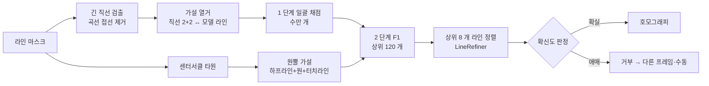

# Soccer 3D Digital Twin — 기술 및 기능 명세 (5부)

## 자동 초기 보정 — 기준점 입력 없이 경기장 보정

> **이전 문서**: [1부](./PROJECT_OVERVIEW.md) · [2부](./PROJECT_OVERVIEW_2_VIDEO_ANALYSIS.md) · [3부](./PROJECT_OVERVIEW_3_VLM.md) · [4부 — 고정밀 분석 모드](./PROJECT_OVERVIEW_4_PRECISE_ANALYSIS.md)
>
> 4부에서 매 프레임 라인 정렬로 보정 누적 오차를 없앴지만, **첫 키프레임은 사람이 기준점 4 개 이상을 찍어야** 했습니다(4부 36절 한계 1 순위). 이 문서는 그 단계를 자동화한 내용입니다. 절 번호는 4부(28~36절)에 이어 37절부터 시작합니다.
>
> 작성 기준: 2026-10-05

---

## 목차

37. [방향: 학습 없는 기하 방식](#37-방향-학습-없는-기하-방식)
38. [단일 프레임 자동 보정](#38-단일-프레임-자동-보정)
39. [센터서클 장면 — 원뿔 곡선 기하](#39-센터서클-장면--원뿔-곡선-기하)
40. [영상 전체 자동 키프레임](#40-영상-전체-자동-키프레임)
41. [API · 화면](#41-api--화면)
42. [검증](#42-검증)
43. [한계와 다음 단계](#43-한계와-다음-단계)

---

## 37. 방향: 학습 없는 기하 방식

3부·4부에서는 자동 보정을 **경기장 키포인트 검출 모델**(RF-DETR keypoint, Roboflow football-field 데이터셋) 학습으로 계획했습니다. 그러나 현재 환경은 GPU 가 없고 외부 모델·데이터셋 접근도 제한되어 학습이 어렵습니다. 그래서 이미 갖춘 재료만으로 동작하는 **기하 방식**을 먼저 구현했습니다.

| 재료 | 출처 |
|---|---|
| 프레임별 경기장 라인 마스크 | 4부 `line_mask()` (정밀 분석 중 저장, 없으면 영상에서 생성) |
| FIFA 규격 라인 모델 | 4부 `pitch_polylines()` |
| 정밀 정렬 | 4부 `LineRefiner` |

키포인트 모델이 생기면 38절의 "가설 열거"를 모델 출력으로 바꾸면 되고, 채점·확신도·교차 검증·전파는 그대로 씁니다(43절).

---

## 38. 단일 프레임 자동 보정

구현: `pipeline/autocalib.py` — `AutoCalibrator.calibrate(mask, valid)`



### 38.1 직선 검출 — `detect_lines()`

1. 확률적 허프 변환으로 선분 후보 → 같은 직선의 조각을 묶음
2. 직선 근처 라인 픽셀로 다시 맞추고 **가장 긴 연속 구간**(틈 8 px 이하)만 인정
3. **곡선 거부**: 구간 앞 1/3 과 뒤 1/3 의 방향이 2° 넘게 다르거나 잔차 RMS 0.8 px 초과면 버림 — 멀리 있는 납작한 센터서클의 접선 부분이 직선으로 잡히던 문제(초기 구현에서 잘못된 보정 1 건의 원인) 해결

### 38.2 가설 열거

직선 2 개를 **길이 방향 라인**(y = ±34, ±20.16, ±9.16), 2 개를 **폭 방향 라인**(x = 0, ±36, ±47, ±52.5)에 대응시키고 네 교점으로 호모그래피를 계산합니다. 실제 교차하지 않는 라인(예: 터치라인과 페널티박스 옆선)도 무한 직선의 교점으로 대응됩니다.

경우의 수를 줄이는 기하 조건:

| 조건 | 근거 |
|---|---|
| 화면 위쪽 직선 = y 가 큰(먼) 라인, 화면 왼쪽 직선 = x 가 작은 라인 | 중계 카메라 영상은 거울상이 없음 → 좌우 대칭 모호성 제거 |
| 같은 방향 두 직선의 교점(소실점)이 **보이는 경기장 영역 안**에 있으면 안 됨 | 경기장에서 평행한 라인 |
| 길이 방향 후보는 수평에서 40° 이내 | 중계 화면의 터치라인·박스선 |

직선 7~9 개면 수천~5 만 개 가설이 나오며, 4 점 DLT 를 NumPy 로 **일괄** 풉니다.

### 38.3 채점 — 2 단계

| 단계 | 대상 | 점수 |
|---|---|---|
| 1 | 전체 가설 (일괄) | 1 m 간격 모델 점을 투영 → 경기장 영역에 보이는 점 중 라인 2.5 px 이내 비율(정밀도) × 맞은 점 수 |
| 2 | 상위 120 개 (화면 아래쪽 세 점의 경기장 위치가 1.5 m 이내인 중복 해석은 하나만) | 투영 모델을 그려 라인 픽셀이 얼마나 설명되는지(재현율) → **F1** |
| 정렬 | 상위 8 개 | `LineRefiner` 로 정렬 후 F1 재계산 |

추가로 그럴듯함 검사: 화면 오른쪽 = x 증가, 화면 위 = 먼 쪽, 화면 폭이 경기장 5~200 m, 화면 아래쪽이 카메라 앞.

### 38.4 확신도 — 틀린 보정을 내지 않기

틀린 자동 보정은 수동 보정보다 해롭습니다(전 구간 좌표가 틀어짐). 그래서 **세 조건을 모두** 만족할 때만 채택합니다.

| 조건 | 기준 |
|---|---|
| F1 | ≥ 0.6 |
| 재현율 | ≥ 0.55 (보이는 라인 대부분을 설명) |
| 모호성 | 화면 위치가 4 m 이상 다른 **2 등 해석의 F1 / 1 등 F1 ≤ 0.85** |

---

## 39. 센터서클 장면 — 원뿔 곡선 기하

중계에서 가장 흔한 장면 중 하나인 센터서클 화면에는 **폭 방향 직선이 하프라인 하나뿐**이라 38.2 의 "직선 2+2" 가설을 만들 수 없습니다. 이 장면은 원(타원)의 사영 기하로 풉니다 — `circle_hypotheses()`.

1. 직선 픽셀을 지운 나머지 곡선에서 타원을 맞춤 (하프라인에 둘로 갈린 원은 조각 쌍으로)
2. 하프라인과 타원의 두 교점 = (0, ±9.15) — 화면 위쪽이 먼 쪽
3. 하프라인 위의 세 대응 (0, 9.15), (0, −9.15), 터치라인 교점 (0, ±34) 으로 **1 차원 사영 변환**을 풀어 원 중심 (0, 0) 의 화면 위치를 구함 (원근 때문에 타원 중심과 다름)
4. 하프라인의 **극점**(pole, `C⁻¹ l`) = 길이 방향 소실점
5. 원 중심과 소실점을 잇는 직선(y = 0)과 타원의 교점 = (∓9.15, 0)
6. 네 점으로 호모그래피 → 38.3 과 같은 채점·정렬·확신도

---

## 40. 영상 전체 자동 키프레임

구현: `auto_keyframes()`, `video_analysis.auto_calibrate()`

| 단계 | 내용 |
|---|---|
| 프레임 선택 | 2 초 간격 + 장면 전환 직후(그 프레임과 3 프레임 뒤) |
| 단일 프레임 보정 | 38~39절. 확신할 때만 키프레임 |
| **교차 검증** | 이웃한 자동 키프레임끼리, 앞 키프레임의 보정을 카메라 움직임으로 뒤 프레임에 옮긴 값과 뒤 키프레임의 보정이 3 m 넘게 다르면 점수 낮은 쪽 제거 (같은 장면 구간에서만) |
| 수동 우선 | 기존 수동 키프레임은 유지하고, 그 ±1 초 안의 자동 키프레임은 버림 |
| 전파 | 4부 `track_homographies()` — 키프레임 사이를 카메라 움직임 + 매 프레임 라인 정렬 |

자동 키프레임은 기준점 대신 `homography`(9 개 값)와 `source: "auto"`, 일치도 `score` 를 저장합니다. 수동 키프레임과 같은 목록에 들어가 기존 보정 흐름이 그대로 동작합니다.

---

## 41. API · 화면

### 41.1 API

| 메서드 | 경로 | 변경 |
|---|---|---|
| `POST` | `/analysis/{name}/calibration/auto` | **신규** — 자동 보정 작업 시작 (백그라운드). 라인 마스크가 없으면(빠른 미리보기 결과) 영상에서 만들어 저장. 분석 전 404, 작업 중 409 |
| `GET` | `/analysis/{name}/status` | `stage`(`analyzing` → `lines` → `calibrating`), `auto_calibration`(`{status: ok \| failed, auto, manual, calibrated_frames}` 또는 실패 이유) |
| `POST` | `/analysis/{name}/calibration` | 키프레임에 `homography`·`source`·`score` 허용 (기준점 대신 호모그래피). 9 개 값이 아니면 400 |
| `DELETE` | `/analysis/{name}` | 자동 보정 작업도 취소 |

설정: `analysis.profiles.precise.auto_calibrate: true` — **고정밀 분석이 끝나면 자동 보정까지 이어서 수행**합니다. 사용자는 영상을 올리고 분석만 누르면 3D 트윈과 경기 지표까지 받습니다. 실패하면 분석 결과는 유지하고 이유를 알려 줍니다.

### 41.2 화면

- 3D 창의 "보정 필요" 안내: **자동 보정**(기본) / **직접 지정** 두 버튼
- 분석 카드: 보정 전이면 **자동 보정** 버튼, 진행 단계 표시(라인 검출 중 → 자동 보정 중), 결과 **키프레임 자동 n · 수동 m**, 실패 이유
- 수동 기준점 지정은 그대로 — 자동 보정이 놓친 구간에 키프레임 추가

---

## 42. 검증

### 42.1 단일 프레임 (합성 중계 영상, 4부 35절과 같은 생성기)

| 구성 | 결과 |
|---|---|
| 팬·줌 영상 2 개 × 12 프레임 (센터서클·페널티박스·코너 쪽 장면 포함) | **24 / 24 채택, 모두 오차 0.18 m 이하** (대부분 0.01~0.09 m) |
| 강한 줌(초점거리 3.5 배) 9 장면 | 8 채택 (오차 0.01~0.04 m), 1 거부 |
| 잡음 영상 · 터치라인 하나만 보이는 화면 | 거부 |
| `data/raw/sample_video.mp4` (FIFA 비율이 아닌 2D 도식) | 거부 (해석이 애매함) |
| 1 장당 시간 (4 코어 CPU, 540p 마스크) | 0.05 ~ 5 초 (직선 수에 따라) |

> 개발 초기에는 F1 0.65 로 **틀린 보정을 채택**한 경우가 있었습니다(센터서클 접선을 직선으로 잘못 검출). 곡선 거부(38.1)와 센터서클 전용 해법(39절)을 넣은 뒤로 위 시험에서 틀린 채택은 없습니다.

### 42.2 영상 전체 — 기준점 입력 없음 (`scripts/benchmark_precise.py`, 300 프레임)

| 구성 | 보정 오차 평균 (seed 0 / 1) | 선수 위치 오차 평균 | 사람 입력 |
|---|---|---|---|
| realtime + 수동 키프레임 1 개 | 3.31 / 1.81 m | 2.45 / 1.30 m | 기준점 5 개 |
| precise + 수동 키프레임 1 개 | 0.074 / 0.162 m | 0.470 / 0.471 m | 기준점 5 개 |
| **precise + 자동 보정** | **0.073 / 0.098 m** | **0.474 / 0.390 m** | **없음** |

- 자동 키프레임: 0, 60, 120, 180, 240 프레임 (2 초 간격 모두 채택), 300 / 300 프레임 보정
- 자동 보정은 클릭 오차가 없고 키프레임이 여러 개라, 수동 키프레임 1 개보다 같거나 더 정확했습니다.
- 자동 보정 시간: 10 초 영상에 약 20 초 (4 코어 CPU)

### 42.3 테스트 — `tests/test_autocalib.py` (13 개)

| 테스트 | 검증 내용 |
|---|---|
| `test_detect_lines_keeps_straight_lines_and_rejects_arcs` | 직선 2 개 검출, 납작한 타원은 직선으로 잡지 않음 |
| `test_auto_calibrate_frame_matches_ground_truth` (4 장면) | 정답 대비 0.3 m 이내, 확신도 조건 |
| `test_center_circle_view_uses_conic_solver` | 직선 3 개 이하 센터서클 화면 → 원뿔 해법으로 0.3 m 이내 |
| `test_refuses_noise_and_single_line` | 잡음·터치라인 하나 → 거부 |
| `test_auto_keyframes_cover_clip_without_manual_input` | 입력 없이 전 프레임 보정, 평균 오차 < 0.2 m |
| `test_inconsistent_auto_keyframe_is_dropped` | 10 m 어긋난 키프레임을 교차 검증으로 제거 |
| `test_auto_calibrate_keeps_manual_keyframes` | 수동 키프레임 유지·우선, 자동 실패 시 ValueError |
| `test_keyframe_homography_accepts_direct_matrix` | 호모그래피 키프레임, 특이 행렬 거부 |
| `test_precise_analysis_calibrates_automatically` | API: 고정밀 분석만으로 보정·지표까지 (평균 오차 < 0.25 m) |
| `test_auto_calibration_endpoint_on_realtime_result` | API: 미리보기 결과 → 라인 마스크 생성 → 자동 보정, 자동 키프레임 재저장, 잘못된 homography 400 |

```bash
python -m pytest tests -q        # 68 passed
```

### 42.4 브라우저 확인

빠른 미리보기로 분석한(보정 전) 합성 중계 영상을 열고 3D 창의 **자동 보정**을 누르면, 라인 검출 → 자동 보정 단계를 거쳐 18 초 만에 100 % 프레임이 보정되고(자동 키프레임 4 개), 투영한 경기장 라인이 영상 라인과 겹치는 것을 확인했습니다.

---

## 43. 한계와 다음 단계

| 구분 | 내용 |
|---|---|
| 실제 중계 영상 | 이번에도 정량 검증은 합성 영상 기준. 실제 영상의 그림자·닳은 라인·광고판 위 흰 줄은 직선 후보를 늘리고, 라인이 적게 보이는 장면은 거부될 수 있음 (확신도 조건 덕분에 "틀리기"보다 "거부"하도록 설계) |
| 거부되는 장면 | 라인이 한 방향만 보이는 중앙 장면(센터서클·하프라인 없이 터치라인만), 클로즈업 — 앞뒤 키프레임에서 전파되므로 영상 전체로는 대개 보정됨 |
| 남은 기하 해법 | 페널티 아크·골에어리어만 보이는 장면은 아직 직선 가설에 의존 |
| 시간 | 직선이 많으면 프레임당 수 초 — 긴 경기는 샘플 간격 조정 필요 |

**다음 단계**

1. **키포인트 모델 연동** — 학습 환경(GPU)이 생기면 가설 열거를 모델 출력으로 대체해 속도·재현율을 높이고, 채점·확신도·교차 검증은 그대로 사용
2. **실제 중계 영상 검증** — 몇 프레임을 수동 보정해 정답으로 삼고 자동 보정 오차·채택률 측정
3. **SigLIP2 팀 분류**, **공 전용 모델** (4부 36.2 로드맵 순서대로)
